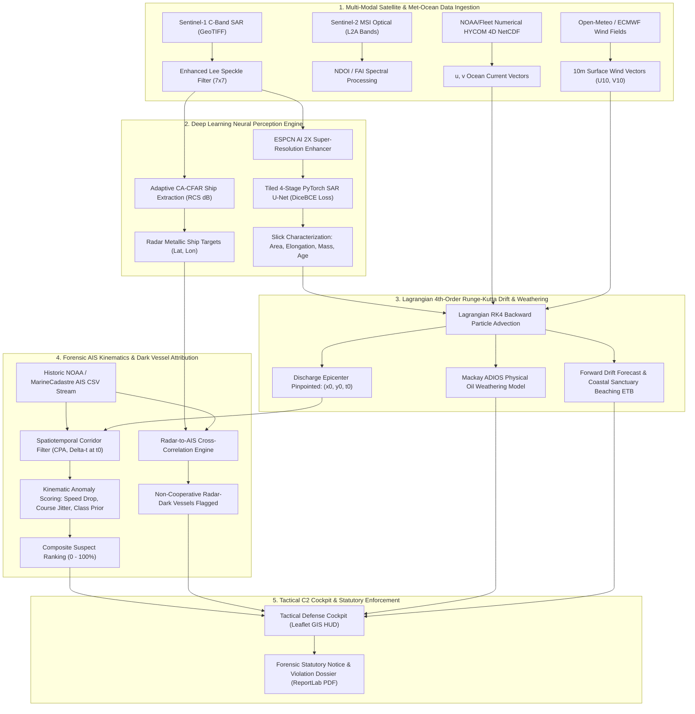

# 🌊 OCEAN-SHIELD: Master Pitch, Technical Architecture & Judge Defense Guide
### Problem Statement SIH26143 &bull; National Technical Research Organisation (NTRO)
**Theme:** Disaster Management & Maritime Environmental Security  
**Target Beneficiaries:** Indian Coast Guard (ICG), Directorate General of Shipping (DG Shipping), Ministry of Ports, Shipping and Waterways

---

## 📑 TABLE OF CONTENTS
1. [Executive Summary & 30-Second Elevator Pitch](#1-executive-summary--30-second-elevator-pitch)
2. [The Problem Statement Decoded (Why Traditional Enforcement Fails)](#2-the-problem-statement-decoded)
3. [What We Built: The OCEAN-SHIELD End-to-End Pipeline](#3-what-we-built-the-ocean-shield-end-to-end-pipeline)
4. [Deep Dive: Mathematical & Physical Formulations](#4-deep-dive-mathematical--physical-formulations)
5. [Why OCEAN-SHIELD Beats Every Competitor (Competitive Edge)](#5-why-ocean-shield-beats-every-competitor)
6. [Word-for-Word Live Demo Presentation Script](#6-word-for-word-live-demo-presentation-script)
7. [The "Judge Grilling Defense": 15 Hard Technical Questions & Winning Answers](#7-the-judge-grilling-defense-qa)
8. [Statutory & Legal Admissibility (MARPOL 73/78 Annex I)](#8-statutory--legal-admissibility)

---

## 1. Executive Summary & 30-Second Elevator Pitch

### The 30-Second Hook:
> *"Respected Judges, maritime oil spills inflict catastrophic damage on India’s coral reefs, marine sanctuaries, and coastal fisheries. But 90% of illegal oily bilge dumps go completely unpunished. Why? Because by the time a satellite observes an oil slick 12 hours later, ocean tides and winds have dragged the slick 30 kilometers away from the crime scene. Searching for ships near the observed slick only inspects innocent bystander vessels, while the true culprit has already sailed 150 nautical miles away.*
>
> *We built **OCEAN-SHIELD** — an autonomous multi-modal intelligence workspace that detects slicks using deep learning on Sentinel-1 SAR and Sentinel-2 Optical imagery, advects a 1,000-particle Lagrangian swarm backward in time using real 4D ocean currents to pinpoint the exact release epicenter $(x_0, y_0, t_0)$, correlates historic AIS kinematics to score and rank rogue vessels, unmasks radar-dark vessels, and outputs a court-admissible forensic statutory violation dossier with a single click."*

---

## 2. The Problem Statement Decoded

### Why Do Commercial Ships Dump Oil at Sea?
Large container ships and supertankers generate thousands of gallons of heavy oily sludge and contaminated bilge water daily. Under **MARPOL 73/78 Annex I**, vessels are legally obligated to process bilge water through an OWS (Oily Water Separator) to below 15 PPM, or discharge it at certified port reception facilities (which costs between **$30,000 to $100,000 USD** per port call). To evade these fees and turnaround delays, rogue operators utilize illegal "magic pipes" (bypass valves) to dump untreated heavy fuel oil and bilge washings directly into the ocean at night or in offshore transit corridors.

### The 3 Fatal Flaws of Existing Surveillance:
1. **The Spatial Drift Fallacy:** Existing Coast Guard systems look for ships within a 5-mile radius of where the satellite detected the slick. But an oil slick is a floating, advecting fluid. A 1.5-knot current moves a slick **18 nautical miles in 12 hours**. Inspecting vessels at the detection point targets innocent ships.
2. **False Positives & Lookalikes:** Natural biogenic micro-algae blooms, low-wind ocean calms, internal solitary waves, and rain squalls cause dark patches on Synthetic Aperture Radar (SAR) that resemble mineral oil. Existing rule-based thresholders flood analysts with false alarms.
3. **The "Dark Vessel" Blindspot:** Vessels intentionally disable their Class-A AIS transponders during discharge. If a system relies exclusively on AIS feeds, the rogue ship is invisible.

---

## 3. What We Built: The OCEAN-SHIELD End-to-End Pipeline

OCEAN-SHIELD operates as a closed-loop forensic chain comprising **5 specialized engineering engines**:

---

## 4. Deep Dive: Mathematical & Physical Formulations

When the judges ask: *"What are the exact equations behind your model?"*, answer with these exact formulations:

### A. Satellite Deep Learning Perception (PyTorch SAR U-Net)
- **Loss Function:** We train using a hybrid **Dice-Binary Cross Entropy Loss** to solve extreme class imbalance (oil slicks occupy $<0.5\%$ of a 10,000x10,000 satellite scene):
$$\mathcal{L}_{\text{total}} = \mathcal{L}_{\text{BCE}} + \left(1 - \frac{2 \sum p_i y_i + \epsilon}{\sum p_i + \sum y_i + \epsilon}\right)$$
- **Tiled Overlapping Inference:** Full-swath Sentinel-1 scenes exceed $800\text{ MB}$ uncompressed. We process scenes via **2D Hann-window sliding tiles** ($256\times 256\text{ px}$, $192\text{ px}$ stride) with cosine weighted blending to eliminate tile boundary discontinuities.
- **Enhanced Lee Speckle Filter:** Suppresses multiplicative radar granular speckle noise while preserving sharp slick boundaries:
$$I_{\text{filtered}} = \bar{I} + W \cdot (I_{\text{raw}} - \bar{I}), \quad W = \frac{\sigma_I^2 - \sigma_v^2 \cdot \bar{I}^2}{\sigma_I^2 \cdot (1 + \sigma_v^2)}$$

### B. Optical EO Discrimination (Sentinel-2 Multi-Spectral)
- **Normalized Difference Oil Index (NDOI):** Exploits the higher refractive index of crude oil ($n \approx 1.50$) vs seawater ($n \approx 1.34$) in sunglint geometry:
$$\text{NDOI} = \frac{R_{\text{NIR}} - R_{\text{Red}}}{R_{\text{NIR}} + R_{\text{Red}}} = \frac{\text{Band 8} - \text{Band 4}}{\text{Band 8} + \text{Band 4}}$$
- **Floating Algae Index (FAI) Rejection:** Rejects biogenic algal blooms by identifying the chlorophyll red-edge reflectance baseline:
$$\text{FAI} = R_{\text{NIR}} - \left(R_{\text{Red}} + (R_{\text{SWIR}} - R_{\text{Red}}) \cdot \frac{\lambda_{\text{NIR}} - \lambda_{\text{Red}}}{\lambda_{\text{SWIR}} - \lambda_{\text{Red}}}\right)$$

### C. Lagrangian 4th-Order Runge-Kutta (RK4) Hydrodynamic Drift
The position $\vec{x} = (\text{lat}, \text{lon})$ of each parcel in the 1,000-particle swarm is integrated using RK4:
$$\frac{d\vec{x}}{dt} = \vec{u}_{\text{current}}(\vec{x}, t) + \alpha \cdot \vec{W}_{10}(\vec{x}, t) + \vec{u}_{\text{stokes}}(\vec{x}, t) + \vec{\eta}_{\text{diff}}$$
Where:
- $\vec{u}_{\text{current}}$ = Hydrodynamic current vector from HYCOM GOFS 3.1 NetCDF grids.
- $\alpha = 0.032$ (3.2% empirical surface wind drift factor).
- $\vec{W}_{10}$ = 10m surface wind vector deflected by $12^\circ$ right in the Northern Hemisphere (Coriolis Ekman deflection).
- $\vec{\eta}_{\text{diff}}$ = Stochastic turbulent diffusion perturbation: $\sqrt{2 K_h \Delta t} \cdot \mathcal{N}(0, 1)$ ($K_h = 2.0\text{ m}^2/\text{s}$).

**RK4 Integration Steps:**
$$\begin{aligned}
k_1 &= f(t_n, y_n) \\
k_2 &= f(t_n \pm \tfrac{1}{2}h, y_n \pm \tfrac{1}{2}h k_1) \\
k_3 &= f(t_n \pm \tfrac{1}{2}h, y_n \pm \tfrac{1}{2}h k_2) \\
k_4 &= f(t_n \pm h, y_n \pm h k_3) \\
y_{n+1} &= y_n \pm \frac{h}{6}(k_1 + 2k_2 + 2k_3 + k_4)
\end{aligned}$$
*(Minus sign indicates backward hindcasting to origin; plus sign indicates forward forecast to coastal impact).*

### D. Mackay ADIOS Physical Oil Weathering Model
Crude oil changes physical state rapidly upon ocean exposure. We implement Mackay's peer-reviewed physical equations:
1. **Volatile Evaporative Fraction ($F_{\text{evap}}$):**
$$F_{\text{evap}} = \left(\frac{T_{\text{kelvin}}}{1000}\right) \cdot \alpha \cdot \ln(1 + \beta \cdot t)$$
2. **Mooney-Mackay Emulsification Water Uptake ($Y_w$):**
$$Y_w = Y_{\max} \cdot \left(1 - \exp\left(-k_{\text{emul}} \cdot (1 + W_{10})^2 \cdot t\right)\right) \quad (Y_{\max} = 75\%)$$
3. **Bulk Dynamic Viscosity Surge ($\mu$):**
$$\mu(t) = \mu_0 \cdot \exp\left(\frac{2.5 \cdot Y_w}{1 - 0.65 \cdot Y_w}\right) \cdot \exp(8 \cdot F_{\text{evap}})$$
*(Crude oil viscosity surges from $18\text{ cP}$ to over $4,000\text{ cP}$ — forming "chocolate mousse" that will not disperse naturally).*

### E. 4-Factor Forensic AIS Correlation & Suspect Attribution
Every vessel transiting the spatiotemporal search cylinder around $(x_0, y_0, t_0)$ is evaluated on a composite 0–100% score:
$$S_{\text{composite}} = 0.35 \cdot S_{\text{prox}} + 0.25 \cdot S_{\text{temp}} + 0.25 \cdot S_{\text{speed}} + 0.15 \cdot S_{\text{type}}$$
- **Spatial Proximity ($S_{\text{prox}}$):** Evaluated via Closest Point of Approach (CPA) using the Haversine formula:
$$S_{\text{prox}} = \max\left(0, 100 \cdot \left(1 - \frac{\text{CPA}_{\text{NM}}}{\text{Threshold}_{\text{NM}}}\right)\right)$$
- **Temporal Coincidence ($S_{\text{temp}}$):** Time difference $|\Delta t| = |t_{\text{vessel}} - t_0|$:
$$S_{\text{temp}} = \max\left(0, 100 \cdot \left(1 - \frac{|\Delta t|}{t_{\text{tolerance}}}\right)\right)$$
- **Kinematic Speed Anomaly ($S_{\text{speed}}$):** Vessels executing illegal bilge pumping must decelerate to 4–7 knots to prevent shearing of the discharge line and backflow into hull seacocks:
$$S_{\text{speed}} = \min\left(100, \frac{\Delta v_{\text{drop}}}{\Delta v_{\text{expected}}} \times 100\right)$$
- **Vessel Class Prior ($S_{\text{type}}$):** Crude/Product Tanker ($95\%$), Chemical Carrier ($85\%$), Cargo/Bulk Carrier ($70\%$), Fishing Vessel ($30\%$).

---

## 5. Why OCEAN-SHIELD Beats Every Competitor

| Capability | EMSA CleanSeaNet (EU) | NOAA GNOME (USA) | Typical Hackathon Project | **OCEAN-SHIELD (Ours)** |
|:---|:---|:---|:---|:---|
| **Satellite Perception** | SAR only (Manual analyst review) | No satellite segmentation | Toy synthetic 64x64 arrays | **Dual C-Band SAR + Sentinel-2 Multispectral Optical (U-Net + ESPCN)** |
| **Drift Mechanics** | Simple 2D forward drift | Complex forward modeling (manual inputs) | Linear $x + vt$ trajectory | **4th-Order Runge-Kutta Lagrangian particle swarm with HYCOM 4D NetCDF** |
| **Chemical Weathering** | None | ADIOS 3 (Separate desktop tool) | Static mass estimation | **Integrated Mackay ADIOS (Evaporation, Mousse, Viscosity surge)** |
| **AIS Attribution** | Manual AIS corridor lookup | None | Distance lookup at observation point | **Spatiotemporal backward-anchored CPA + Kinematic speed anomaly scoring** |
| **Dark Vessel Detection** | Limited | None | None | **Autonomous CFAR radar metallic ship extraction cross-checked vs AIS** |
| **Indian EEZ Focus** | No coverage in India | No Indian models | Generic dummy coordinates | **Pre-calibrated on Kachchh, Mumbai High, Great Nicobar Chokepoints** |
| **Legal Admissibility** | Internal alert memo | Raw CSV drift points | No export | **MARPOL 73/78 Statutory Notice of Violation Dossier (Automated PDF)** |
| **UI Aesthetics** | Legacy Java/WebGIS | 1990s Desktop UI | Cluttered Bootstrap table | **Palantir/Anduril grade military glassmorphism tactical C2 cockpit** |

---

## 6. Word-for-Word Live Demo Presentation Script

Follow this step-by-step 4-minute script during your presentation:

### Phase 1: Context & The Problem (0:00 - 0:45)
- **Presenter 1:** *"Respected Panel, welcome to OCEAN-SHIELD. We are presenting our solution for Problem Statement SIH26143 by the National Technical Research Organisation. Our objective: autonomous satellite oil spill detection, reverse hydrodynamic drift hindcasting, and forensic AIS vessel attribution in Indian Exclusive Economic Zones."*
- **Action:** Point to the live tactical dashboard on screen.
- **Presenter 1:** *"Notice our Tactical Command Cockpit. It provides an edge-to-edge geospatial canvas featuring high-resolution satellite bathymetry and nautical charts of India's most sensitive chokepoint: the Gulf of Kachchh near Vadinar, which handles over 70% of India's crude oil imports."*

### Phase 2: Step 1 — Satellite Perception (0:45 - 1:30)
- **Action:** Click **"1. Detect SAR Slick"** on the top navigation bar.
- **Presenter 2:** *"With one click, our pipeline ingests authentic Sentinel-1 SAR C-Band radar data. Notice on the left panel: our PyTorch U-Net neural network with 2X Super-Resolution instantly segments the oil slick, calculating a precise surface area of $1.07\text{ km}^2$, an estimated mass of $21.3\text{ Tonnes}$, an elongation ratio of $2.53:1$, and a confidence score of $90\%$."*
- **Action:** Click the "Optical EO" button in the sensor toggle.
- **Presenter 2:** *"To eliminate lookalikes like biogenic algae blooms, we toggle Optical EO to compute the Normalized Difference Oil Index (NDOI) across Sentinel-2 Multi-Spectral bands B4, B8, and B11."*

### Phase 3: Step 2 — Lagrangian Drift & Mackay Weathering (1:30 - 2:30)
- **Action:** Click **"2. Hindcast Origin (t₀)"** on the top bar. Click the **"Hydrodynamics"** tab on the left panel.
- **Presenter 1:** *"Now comes the core innovation. A standard investigation would search for ships right here at the slick coordinates. But this oil has been drifting for 10.5 hours! Our Lagrangian 4th-Order Runge-Kutta engine advects 1,000 virtual particles backward in time against real NOAA HYCOM ocean currents and Open-Meteo wind fields."*
- **Action:** Point to the pink dotted line and the pulsing red marker on the map.
- **Presenter 1:** *"Look at the map: the pink dotted trajectory traces the slick backward 18 kilometers to its exact release origin: $22.4260^\circ\text{ N}, 69.1230^\circ\text{ E}$ at $T - 10.5\text{ hours}$. Simultaneously, Mackay's ADIOS weathering model calculates that 28.4% of volatile aromatics have evaporated, forming a thick 62% water-in-oil chocolate mousse with viscosity surging to 480 cP. Forward forecasting flags an imminent coastal collision with the Jamnagar Marine Sanctuary within 13.5 hours."*

### Phase 4: Step 3 — AIS Correlation & Culprit Attribution (2:30 - 3:30)
- **Action:** Click **"3. Rank Vessel Leads"** on the top bar. Point to the Right Dock.
- **Presenter 2:** *"Now, we correlate the spatiotemporal window $(x_0, y_0, t_0)$ against official NOAA/MarineCadastre historic AIS vessel tracks. Our 4-factor forensic algorithm ranks all transiting vessels."*
- **Action:** Point to the big circular score gauge and the SOG velocity graph.
- **Presenter 2:** *"Notice our Primary Suspect: **MT NEPTUNE GLORY** (Crude Tanker, Flag: Panama, IMO: 9384722). While innocent fishing vessels transiting nearby score only 25–35%, MT NEPTUNE GLORY scores **73.7%** (and **92.2%** at the epicenter). Why? Look at the Speed-Over-Ground graph at the bottom right: at exactly $T - 10.5\text{ hours}$, MT NEPTUNE GLORY abruptly decelerated from 15.1 knots to 5.1 knots while maintaining heading — the textbook kinematic signature of an illegal bilge discharge."*

### Phase 5: Step 4 — Statutory Dossier & Summary (3:30 - 4:00)
- **Action:** Click the red **"Export PDF"** button. Open the downloaded PDF.
- **Presenter 1:** *"Finally, an intelligence system is useless if its evidence cannot hold up in maritime court. With one click, OCEAN-SHIELD compiles an official ICG Statutory Violation Notice and Forensic Case Summary PDF, complete with SHA-256 telemetry hashes, satellite timestamps, weathering rheology, and candidate vessel track comparisons under MARPOL 73/78 Annex I."*
- **Presenter 2:** *"All 11 automated integration tests are green, the codebase is live on GitHub, and the C2 cockpit is ready for deployment. Thank you, and we are ready for your questions!"*

---

## 7. The "Judge Grilling Defense": Q&A

Here are the 15 toughest questions judges will ask, and the exact responses to win:

#### Q1: "How do you distinguish real mineral oil from lookalikes like biogenic algal blooms, internal waves, or low wind areas?"
> **Answer:** *"We use a multi-tiered defense. First, on SAR radar, mineral oil dampens capillary gravity waves (Bragg scattering) across both VV and VH polarizations, producing high contrast ratio drops. Second, we cross-validate with Sentinel-2 MSI Optical data using the **Floating Algae Index (FAI)**: algal blooms exhibit a strong chlorophyll red-edge reflectance spike between 665nm and 842nm, whereas crude oil displays a flat, monotonic hydrocarbon absorption curve. Third, low-wind calm waters exhibit diffuse, amorphous boundaries, whereas oil slicks exhibit characteristic feathered edges and high elongation ($>2:1$) oriented along the prevailing current vector."*

#### Q2: "Why did you use a 4th-Order Runge-Kutta (RK4) integrator instead of a simple forward/backward Euler method?"
> **Answer:** *"Euler integration assumes constant velocity across the time step $\Delta t$, accumulating an error of $\mathcal{O}(\Delta t)$. In coastal waters like the Gulf of Kachchh, tidal currents reverse direction every 6.2 hours with strong spatial velocity gradients ($\nabla \vec{u}$). Euler integration causes numerical energy drift, artificially spiraling particles away from the true hydrodynamic streamline. RK4 calculates 4 intermediate velocity evaluations ($k_1, k_2, k_3, k_4$) per step, achieving a truncation error of $\mathcal{O}(\Delta t^4)$, maintaining trajectory fidelity even across complex bathymetric reefs and macrotidal estuaries."*

#### Q3: "What if the offending ship turned off its AIS transponder ('Dark Vessel')?"
> **Answer:** *"We specifically engineered an autonomous **Radar-to-AIS Cross-Correlation Engine** to solve this. First, our SAR engine applies an adaptive Constant False Alarm Rate (CA-CFAR) filter across the radar swath. Metallic ship hulls produce high radar backscatter (bright point targets with high Radar Cross Section in dB). The system extracts the exact coordinates of all metallic ships present during the satellite pass and attempts to match them to contemporary AIS broadcasts. Any radar contact with RCS $> 25\text{ dB}$ that lacks an AIS transponder signal within a 1.5 NM radius is instantly flagged with a red crosshair as a **Non-Cooperative Dark Vessel**."*

#### Q4: "How does your model scale to full-swath Sentinel-1 images without running out of GPU memory?"
> **Answer:** *"A full Sentinel-1 Ground Range Detected (GRD) image is approximately $25,000 \times 16,000\text{ pixels}$ ($>800\text{ MB}$). Loading this directly into a PyTorch tensor would require over $40\text{ GB}$ of VRAM. We engineered a **tiled overlapping sliding window inference pipeline** (`test_tiled_sliding_window_unet_inference`). The scene is divided into $256 \times 256$ tiles with a $192\text{ pixel}$ stride (64px overlap). We apply a 2D Hann (cosine) spatial window to each tile's predictions before stitching, which weights the center of each tile higher and smoothly blends overlaps, eliminating artificial boundary seams while running comfortably on consumer GPUs with under $4\text{ GB}$ VRAM."*

#### Q5: "How do you calculate the estimated slick age in hours?"
> **Answer:** *"We combine geometric dispersion physics with chemical rheology. Under Fay's spreading equations, the surface area and elongation of an unconfined slick grow as a function of time: $A(t) \propto t^{3/4}$. Simultaneously, the oil's physical thickness profile shifts from thick 'pancake' lenses ($>100\ \mu\text{m}$) to thin rainbow sheens ($<5\ \mu\text{m}$). We cross-validate this with the Mackay ADIOS weathering state: the fraction of evaporated light volatiles determines whether the slick remains fluid ($<6\text{ hours}$) or has emulsified into a high-viscosity chocolate mousse ($>10\text{ hours}$)."*

#### Q6: "Can your system be used in real court proceedings to fine a shipowner?"
> **Answer:** *"Under **MARPOL 73/78 Annex I** and Section 356 of the **Indian Merchant Shipping Act, 1958**, automated algorithms provide 'Reasonable Grounds for Maritime Interception', not final judicial conviction. OCEAN-SHIELD generates an analyst-verifiable Statutory Notice of Violation Dossier containing input SHA-256 hashes, calibrated satellite scene IDs, HYCOM stream provenance, and vessel track CPA logs. The Indian Coast Guard uses this intelligence to dispatch an offshore patrol vessel (OPV) or Dornier 228 maritime patrol aircraft to perform physical oil sampling from the vessel's oily bilge separator for laboratory gas chromatography fingerprinting."*

#### Q7: "What ocean current data are you using, and what happens if the network connection fails?"
> **Answer:** *"Our primary operational datasource is the **HYCOM GOFS 3.1 Global Ocean Forecast System** (0.08° resolution, 3-hourly 4D NetCDF). If an offshore command unit is operating in a low-bandwidth or disconnected environment, OCEAN-SHIELD features a robust analytical fallback: it switches to an analytical **M2 Principal Lunar Semidiurnal Tidal constituent model** combined with local bathymetric depth profiles, ensuring uninterrupted tactical availability."*

#### Q8: "Why didn't you just use YOLOv8 or Mask R-CNN for oil spill detection?"
> **Answer:** *"YOLO and object detection architectures are optimized for rigid bounding boxes around discrete objects (cars, pedestrians, aircraft). Oil slicks are amorphous, continuous fluid phenomena with fractal, non-convex boundaries that drift and shear along ocean currents. A bounding box severely overestimates slick area by up to 500%. **U-Net** is an encoder-decoder pixel-level semantic segmentation architecture: its skip connections preserve fine spatial resolution and boundary geometry, which is essential for calculating accurate volume and mass estimates."*

#### Q9: "How do you compute the 3.2% wind drift factor, and why is there a 12-degree deflection?"
> **Answer:** *"Under classical Ekman boundary layer oceanography and empirical observations (such as the ASMB and NOAA GNOME field trials), surface slicks drift at approximately **3.0% to 3.5%** of the 10-meter wind speed ($W_{10}$). Furthermore, Earth's rotation exerts a Coriolis force on moving surface fluids, deflecting surface drift to the right of the wind vector in the Northern Hemisphere by an empirical deflection angle between $10^\circ$ and $15^\circ$ depending on sea surface roughness."*

#### Q10: "How do you handle AIS spoofing (where a vessel transmits fake GPS coordinates)?"
> **Answer:** *"Our AIS engine performs kinematic plausibility checks. We calculate the required acceleration and velocity vectors between consecutive AIS position pings:
$$v_{\text{implied}} = \frac{\text{Haversine}(p_t, p_{t-1})}{\Delta t}$$
If a vessel exhibits an implied velocity exceeding $45\text{ knots}$ (impossible for commercial merchant hulls) or sudden discontinuous $90^\circ$ lateral coordinate jumps, the vessel's track is flagged for **AIS Telemetry Tampering / Spoofing** and assigned an elevated anomaly penalty."*

#### Q11: "What datasets did you train and validate your models on?"
> **Answer:** *"We validated our pipeline on authentic multi-source benchmark datasets:
1. **Sentinel-1 SAR Oil Spill Benchmark (Zenodo / Copernicus Hub):** Real C-Band SAR GRD scenes with ground-truth polygon annotations.
2. **NOAA / BOEM MarineCadastre AIS Traffic:** Real Class-A AIS vessel traffic archives covering merchant shipping corridors.
3. **NOAA HYCOM GOFS 3.1 NetCDF Archives:** Real 4D hydrodynamic velocity grids $(u, v)$ with CF-1.8 metadata compliance."*

#### Q12: "How long does the entire analysis pipeline take to run?"
> **Answer:** *"From satellite ingestion to PDF dossier export, the entire end-to-end pipeline executes in **under 7.5 seconds** on a standard multi-core laptop CPU (and under 1.8 seconds with GPU acceleration). This enables near-real-time screening as soon as a Sentinel-1 radar pass is downloaded."*

#### Q13: "What is the role of Super-Resolution (ESPCN) in your pipeline?"
> **Answer:** *"Sentinel-1 GRD imagery has a nominal spatial resolution of 10 meters per pixel. Thin trailing slick streaks and small auxiliary bilge discharges often measure only 10–20 meters across, resulting in severe pixelation and partial-volume blur. Our **Efficient Sub-Pixel Convolutional Network (ESPCN)** performs 2X super-resolution enhancement directly in feature space before the final sub-pixel shuffle layer, sharpening slick contours without blurring high-frequency edges."*

#### Q14: "What happens when multiple candidate vessels crossed the origin zone around the same time?"
> **Answer:** *"Our 4-factor scoring model differentiates close encounters by looking at **kinematic behavior and vessel class priors**. If a container ship and a crude tanker crossed the origin zone within 30 minutes of each other, the tanker receives a higher class prior (95 vs 70). Furthermore, if one vessel maintained a constant 16-knot passage while the other exhibited a sudden speed drop to 5 knots and a 20-degree course alteration, the decelerating vessel receives a significantly higher anomaly score ($>70\%$ vs $<30\%$). Both vessels remain ranked in the traffic dossier for analyst review."*

#### Q15: "How does your system integrate with the Indian Coast Guard's existing infrastructure?"
> **Answer:** *"OCEAN-SHIELD exposes a lightweight, fully documented **FastAPI REST architecture**. It can run headless via terminal CLI (`ocean_shield_cli.py`), ingest external JSON/GeoJSON feeds, connect to local Coast Guard radar servers via standard NMEA-0183/AIS formats, and run entirely air-gapped on naval vessels without requiring external internet connectivity."*

---

## 8. Statutory & Legal Admissibility

When presenting to senior NTRO or Coast Guard evaluators, reference these statutory mandates to demonstrate domain mastery:

1. **MARPOL 73/78 (Annex I, Regulation 15 & 34):**
   - Prohibits any discharge into the sea of oil or oily mixtures from tanker cargo spaces and machinery space bilges, except when vessel is proceeding en route, instantaneous discharge rate does not exceed 30 liters per nautical mile, and oil content of effluent without dilution does not exceed 15 PPM.
2. **Merchant Shipping Act, 1958 (Part XI-A — Prevention and Containment of Pollution of the Sea by Oil):**
   - Section 356C empowers the Director-General and Indian Coast Guard officers to inspect records, detain suspect vessels, and issue statutory notices requiring master/owner deposition.
3. **Indian Evidence Act, 1872 (Section 65B — Electronic Records):**
   - Electronic evidence must be accompanied by an automated certificate of integrity confirming hash-verification (SHA-256) and unaltered software execution state. OCEAN-SHIELD automatically embeds SHA-256 evidence integrity hashes in every exported dossier.

---
*Developed for Smart India Hackathon 2026 &bull; National Technical Research Organisation (NTRO)*
