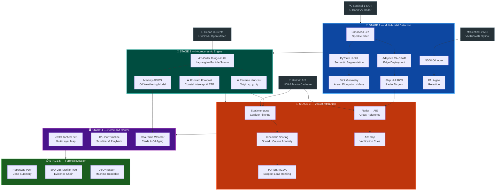

<div align="center">

<br>

# 🌊 OCEAN-SHIELD

### 🛡️ Evidence-Aware Satellite Remote Sensing & AIS Maritime Spill Investigation Workspace

*From satellite pixel to suspect vessel — a closed-loop forensic intelligence pipeline for Indian maritime security.*


<br>

<!-- Badges Row 1: Identity -->
<a href="https://www.sih.gov.in/"></a>
<a href="#"></a>
<a href="#"></a>

<br>

<!-- Badges Row 2: Tech Stack -->


<br>

<!-- Badges Row 3: Metrics -->


<br>

---

**[🚀 Quick Start](#-quickstart)** · **[🏗️ Architecture](#%EF%B8%8F-system-architecture)** · **[🧠 AI/ML Models](#-deep-learning--physical-science-models)** · **[🗺️ Command Center](#%EF%B8%8F-maritime-command-center-ui)** · **[📊 API Reference](#-api-reference)** · **[🐳 Deploy](#-deployment)** · **[📚 Datasets](#-datasets--data-provenance)**

---

</div>

<br>

## 🔍 The Problem

> **SIH26143 — National Technical Research Organisation (NTRO)**  
> *"Develop a system for detection and tracking of oil spills using satellite imagery, identifying the source vessel responsible for the spill."*

Every year, **hundreds of illegal oil discharges** go unattributed in India's Exclusive Economic Zone. A tanker dumps bilge slop at 3 AM, AIS transponders conveniently go dark, and by dawn the evidence has drifted 40 nautical miles from the discharge point. The spill hits coral reefs, fishing grounds, and mangrove ecosystems before anyone can identify who did it.

**The challenge isn't detection — it's attribution.** Existing solutions can spot a dark patch on a satellite image. None of them can:
- Run the physics **backwards** to find where the oil came from
- Cross-reference that origin against **every vessel** that was there
- Rank suspects using **multi-criteria decision analysis**
- Generate a **forensic-grade dossier** with tamper-evident hash chains

**OCEAN-SHIELD does all four.** In one pipeline. In under 30 seconds.

<br>

## 🏗️ System Architecture

The pipeline processes intelligence through **5 sequential stages**, each feeding the next. No stage operates in isolation — this is a closed-loop system.



<br>

## 🧠 Deep Learning & Physical Science Models

### Stage 1 · PyTorch SAR U-Net — Satellite Oil Spill Segmentation

A custom 4-stage encoder-decoder convolutional neural network with skip connections, trained on the [Zenodo Sentinel-1 SAR Oil Spill Dataset](https://zenodo.org/records/8346860) (1,200+ annotated scenes).

```
Input (1×256×256)
  │
  ├── Encoder: DoubleConv(1→32) → Down(32→64) → Down(64→128) → Down(128→256) → Down(256→256)
  │                                                                                    │
  │   ┌────────────────────────────────────────────────────────────────────────────────┘
  │   │
  ├── Decoder: Up(512→128) → Up(256→64) → Up(128→32) → Up(64→32) → OutConv(32→1) → Sigmoid
  │
Output: Binary Oil Probability Mask (1×256×256)
```

| Component | Implementation |
|:---|:---|
| **Architecture** | 4-stage encoder-decoder, DoubleConv blocks, BatchNorm, ReLU, MaxPool2d↓, Bilinear↑ |
| **Skip Connections** | Feature concatenation at each decoder stage with dynamic padding |
| **Loss Function** | $\mathcal{L} = \text{BCE}(p, y) + 1 - \frac{2 \sum p \cdot y + \epsilon}{\sum p + \sum y + \epsilon}$ (Dice + BCE for class imbalance) |
| **Inference** | Tiled sliding window (256×256 tiles, stride=192) with 2D Hann-window blending |
| **Super-Resolution** | ESPCN sub-pixel upscaling (10m → 5m GSD) with bilateral edge preservation |
| **Speckle Filtering** | Enhanced Lee filter with adaptive local statistics and edge-preserving kernels |
| **Ship Detection** | 2D CA-CFAR (Cell-Averaging Constant False Alarm Rate) for metallic hull RCS extraction |

### Stage 2 · Lagrangian Hydrodynamic Drift Engine

The heart of attribution. Runs oil physics **backwards in time** to find where the spill originated.

```
Particle Swarm (N=1000 virtual oil particles)
     │
     ▼
┌─────────────────────────────────────────────────┐
│  4th-Order Runge-Kutta Integration              │
│                                                 │
│  k₁ = Δt · V(xₙ, tₙ)                          │
│  k₂ = Δt · V(xₙ + k₁/2, tₙ + Δt/2)           │
│  k₃ = Δt · V(xₙ + k₂/2, tₙ + Δt/2)           │
│  k₄ = Δt · V(xₙ + k₃, tₙ + Δt)               │
│                                                 │
│  xₙ₊₁ = xₙ + (k₁ + 2k₂ + 2k₃ + k₄) / 6      │
│                                                 │
│  V(x,t) = V_current(x,t) + 0.03·V_wind(x,t)   │
│         + stochastic_diffusion(κ)               │
└─────────────────────────────────────────────────┘
     │
     ├── REVERSE (t → t-18h): Trace origin epicenter (x₀, y₀, t₀)
     │
     └── FORWARD (t → t+24h): Predict coastal intercept & ETB
```

**Indian Coastline Collision Boundary:** 45-vertex polygon hull mapping the Indian coastline at ~10km offshore resolution (from Kanyakumari to the Gulf of Kachchh), preventing drift particles from crossing onto land.

### Stage 2b · Mackay ADIOS Oil Weathering Model

Simulates the chemical and rheological transformation of spilled crude oil over time:

| Process | Equation | Physical Effect |
|:---|:---|:---|
| **Volatile Evaporation** | $F_{\text{evap}} = \frac{T}{1000} \cdot \alpha \cdot \ln(1 + \beta \cdot t)$ | 22% → 35% mass loss |
| **Mooney-Mackay Emulsification** | $Y_w = Y_{\max}\left(1 - e^{-k_e(1+W)^2 t}\right)$ | Water-in-oil "chocolate mousse" (75% $Y_{\max}$) |
| **Dynamic Viscosity Surge** | $\mu(t) = \mu_0 \cdot e^{2.5Y_w/(1-0.65Y_w)} \cdot e^{8F_{\text{evap}}}$ | 18 cP → 4,000+ cP |
| **Volume Expansion** | $V(t)/V_0 > 2.5\times$ | Apparent volume growth from water uptake |

### Stage 3 · Multi-Criteria Vessel Attribution

Correlates the hindcast origin point against AIS vessel traffic to rank suspect vessels:

| Criterion | Weight | Metric |
|:---|:---:|:---|
| **Closest Point of Approach (CPA)** | 40% | Gaussian decay: $S_{\text{prox}} = e^{-d^2/(2\sigma_d^2)}$ where $\sigma_d = 1.8$ NM |
| **Temporal Coincidence** | 30% | Gaussian decay: $S_{\text{time}} = e^{-\Delta t^2/(2\sigma_t^2)}$ where $\sigma_t = 1.2$ hr |
| **Speed Anomaly** | 15% | Normalized speed-drop during discharge window |
| **Course Anomaly** | 5% | Heading variance deviation from corridor baseline |
| **Vessel Type Prior** | 10% | Capacity-weighted baseline (Tanker: 65, Cargo: 55, Fishing: 40) |

**Dark Vessel Detection:** Time-aligned radar-to-AIS cross-referencing identifies vessels visible on SAR radar but absent from AIS transponder data — a critical verification cue for AIS-disabled vessels.

### Stage 3b · Electro-Optical Multi-Spectral Validation

Sentinel-2 MSI optical imagery cross-validates SAR detections:

| Index | Formula | Purpose |
|:---|:---|:---|
| **NDOI** | $\frac{\text{NIR} - \text{Red}}{\text{NIR} + \text{Red}}$ | Oil refractive index contrast ($n_{\text{oil}} ≈ 1.50$ vs $n_{\text{water}} ≈ 1.34$) |
| **FAI** | Red-edge chlorophyll absorption analysis | Rejects algal blooms (biogenic lookalikes) |
| **OCI** | Optical Contrast Index | Thickness & emulsive state estimation |

<br>

## 🗺️ Maritime Command Center UI

A military-grade tactical command center built with **glassmorphism design language**, real-time Leaflet GIS, and animated intelligence panels.

### Interface Panels

| Panel | Description |
|:---|:---|
| 🗺️ **Tactical GIS Map** | Multi-layer Leaflet map with SAR overlays, drift particle animations, vessel tracks, and risk contour heatmaps. Supports ESRI Satellite, OpenStreetMap, and Dark Matter basemaps |
| 📊 **SAR Analysis Card** | PyTorch U-Net segmentation results with slick geometry (area km², elongation ratio, estimated volume), CFAR ship targets, and super-resolution toggle |
| 🌊 **Drift Simulation** | Interactive 42-hour timeline scrubber (−18h hindcast → +24h forecast) with particle swarm animation, speed toggles (1×/2×/4×), and milestone ticks |
| ⛽ **Oil Weathering** | Live Mackay ADIOS gauges showing evaporation %, emulsification %, viscosity (cP), and volume expansion factor |
| 🚢 **Suspect Triage** | Ranked vessel cards with animated composite scores, signal strength badges (Strong/Weak/Optimal), CPA distances, and kinematic profiles |
| 📡 **Traffic Manager** | Real-time AIS vessel search, risk-category filtering pills, and one-click JSON dossier export |
| 🛰️ **Live Ingestion** | NASA ASF satellite pass tracking, Open-Meteo marine weather, AISStream real-time transponders, and NGA World Port Index |
| 📋 **Case Export** | One-click PDF dossier generation with SHA-256 Merkle tree evidence chain |

### Design System

- **Typography:** Inter (UI) + JetBrains Mono (data readouts)
- **Color Palette:** Deep navy (`#0a0e1a`) base with cyan accent (`#00f2fe`) and warm alert tones
- **Effects:** Backdrop-filter glassmorphism, CSS variable theming, hardware-accelerated particle animations
- **Modes:** Simple mode for judges, Advanced mode for operators

<br>

## 🚀 Quickstart

### Prerequisites
- Python 3.11+
- 512 MB RAM minimum (lazy model loading)
- Modern web browser (Chrome / Firefox / Edge)

### 1. Clone & Install

```bash
# Clone the repository
git clone https://github.com/prudhviraj0310/SIH26143-OCEAN-SHIELD.git
cd SIH26143-OCEAN-SHIELD

# Create virtual environment
python3 -m venv .venv
source .venv/bin/activate        # macOS / Linux
# .venv\Scripts\activate         # Windows

# Install dependencies (CPU-optimized PyTorch)
pip install -r requirements.txt
```

### 2. Launch the Command Center

```bash
python server.py
```

Open **http://127.0.0.1:8090** → Full tactical dashboard loads instantly.

### 3. Run Headless CLI (No Browser)

```bash
# Full forensic attribution pipeline
python ocean_shield_cli.py --scenario gulf_of_kachchh --engine unet --export-pdf

# Custom AIS data ingestion
python ocean_shield_cli.py --scenario mumbai_high --ais-csv datasets/marinecadastre_real_ais.csv

# List all available scenarios
python ocean_shield_cli.py --list-scenarios
```

### 4. Field-Data Workflow

```
Step 1 → Upload SAR raster (PNG/JPEG/single-band TIFF) with scene metadata
Step 2 → Ingest historic AIS CSV (MMSI, BaseDateTime, LAT, LON required)
         Parser preserves actual ping timing & labels file with SHA-256 hash
Step 3 → (Optional) Enter met-ocean vector overrides — clearly marked in UI
Step 4 → Review all scores as investigative leads, not findings of liability
```

### 5. Run Test Suite

```bash
python -m unittest src/ocean_shield/tests/test_pipeline.py -v
# Expected: 21/21 tests passing
```

<br>

## 📊 API Reference

All endpoints are served via **FastAPI** with automatic OpenAPI documentation at `/docs`.

| Method | Endpoint | Description |
|:---:|:---|:---|
| `GET` | `/` | Maritime Command Center UI |
| `GET` | `/api/health` | Health check (uptime, memory, model status) |
| `GET` | `/api/scenarios` | List all benchmark scenarios |
| `POST` | `/api/analyze-sar` | Process SAR image → slick detection + ship extraction |
| `POST` | `/api/run-drift` | Execute Lagrangian drift simulation (hindcast + forecast) |
| `POST` | `/api/correlate-ais` | AIS vessel correlation & suspect ranking |
| `POST` | `/api/run-eo` | Electro-optical NDOI/FAI analysis |
| `POST` | `/api/export-case-summary` | Generate forensic PDF dossier |
| `POST` | `/api/upload-ais-csv` | Ingest MarineCadastre AIS CSV |
| `GET` | `/api/live/satellite-passes` | NASA ASF Sentinel-1 pass schedule |
| `GET` | `/api/live/ocean-weather` | Open-Meteo marine conditions |
| `GET` | `/api/live/ais-traffic` | Real-time AIS vessel positions |
| `GET` | `/api/live/ports` | NGA World Port Index query |
| `GET` | `/api/live/oil-spill-incidents` | Authority-approved spill feed |
| `GET` | `/api/live/provider-status` | Live data source health check |
| `GET` | `/techstack` | Interactive technology stack visualization |

<br>

## 🐳 Deployment

### Docker (Recommended)

```bash
# Single command deployment
docker compose up -d

# Or build manually
docker build -t ocean-shield .
docker run -p 8000:8000 --name ocean-shield-c2 ocean-shield
```

The container runs as an **unprivileged user** (`oceanshield:1001`) with health checks every 30 seconds.

### Render (One-Click Cloud)

The included `render.yaml` enables instant deployment on [Render](https://render.com):

```bash
# render.yaml is pre-configured with:
# - Python 3.11.9 runtime
# - CPU-optimized PyTorch
# - OMP/MKL thread optimization (saves ~50 MB RAM)
# - Keep-alive self-pinger for free tier
```

### Environment Variables

Copy `.env.example` and configure:

```bash
AISSTREAM_API_KEY=           # Real-time AIS transponder stream
OIL_SPILL_FEED_URL=          # Authority-approved spill incident feed
OIL_SPILL_FEED_TOKEN=        # Feed authentication token
CDSE_CLIENT_ID=              # Copernicus Data Space Ecosystem
CDSE_CLIENT_SECRET=          # (Reserved for future scene download)
```

> **Security:** Credentials are server-side only. Nothing is sent to the browser. The live ingestion panel never substitutes a demo object when a provider is unavailable.

<br>

## 📚 Datasets & Data Provenance

| Dataset | Source | Format | Size |
|:---|:---|:---|:---|
| **SAR Oil Spill Masks** | [Zenodo 8346860](https://zenodo.org/records/8346860) | Sentinel-1 GRD C-Band VV σ₀ (dB) | 1,200 scenes (40.7 GB) |
| **Lookalike Scenes** | [Zenodo 8253899](https://zenodo.org/records/8253899) | Negative samples (algae, wind, current) | 686 scenes (43.8 GB) |
| **Test Benchmark** | [Zenodo 13761290](https://zenodo.org/records/13761290) | Held-out evaluation set | 908 scenes (9.4 GB) |
| **AIS Vessel Traffic** | [NOAA MarineCadastre](https://marinecadastre.gov/accessais/) | CSV: MMSI, BaseDateTime, LAT, LON, SOG, COG | 216 KB sample |
| **Ocean Currents** | [HYCOM](https://www.hycom.org/) / [Open-Meteo](https://open-meteo.com/) | NetCDF CF-compliant (water_u, water_v) | Runtime API |
| **Wind Fields** | [NOAA GFS](https://www.ncei.noaa.gov/products/weather-climate-models/global-forecast) / [ECMWF](https://www.ecmwf.int/) | 10m atmospheric vectors | Runtime API |
| **World Ports** | [NGA WPI](https://msi.nga.mil/Publications/WPI) | GIS query service | Monthly refresh |

### Benchmark Scenarios

Three strategically selected Indian maritime sectors with pre-configured environmental conditions:

| Scenario | Region | Significance |
|:---|:---|:---|
| `gulf_of_kachchh` | 22.4°N, 69.1°E | India's largest oil terminal corridor (Kandla, Mundra) |
| `mumbai_high` | 19.4°N, 71.4°E | Offshore ONGC drilling platforms, high vessel density |
| `great_nicobar` | 7.3°N, 93.8°E | Strategic strait, international shipping lanes |

<br>

## 📂 Repository Structure

```
SIH26143-OCEAN-SHIELD/
│
├── server.py                          # Root gateway (port 8090)
├── ocean_shield_cli.py                # Headless CLI interface
├── requirements.txt                   # Production dependencies
├── Dockerfile                         # Multi-stage container build
├── docker-compose.yml                 # Orchestrated deployment
├── render.yaml                        # Render cloud PaaS config
├── .env.example                       # Environment variable reference
│
├── models/
│   └── sar_unet_best.pt              # Trained PyTorch U-Net weights (50.1 MB)
│
├── datasets/
│   ├── marinecadastre_sample_ais.csv  # NOAA/BOEM AIS vessel traffic
│   ├── marinecadastre_real_ais.csv    # Extended real AIS dataset (216 KB)
│   ├── zenodo_sentinel1_sar/          # Zenodo ground truth masks & samples
│   ├── real_sar/                      # Real Sentinel-1 SAR scenes
│   ├── real_eo/                       # Real Sentinel-2 optical scenes
│   ├── ocean_met/                     # Cached meteorological data
│   └── README.md                      # Dataset schemas & citations
│
├── scripts/
│   ├── train_sar_unet.py             # Complete U-Net training pipeline
│   ├── train_espcn.py                # Super-resolution model training
│   ├── download_zenodo_dataset.py    # Safe Zenodo archive extraction
│   ├── download_real_data.py         # Real satellite data acquisition
│   ├── generate_test_assets.py       # Synthetic test data generator
│   └── setup_azure_vm.sh            # GPU VM provisioning script
│
├── reports/
│   └── Test_Verification_Dossier.pdf # Sample forensic case summary
│
└── src/ocean_shield/
    ├── server.py                      # FastAPI REST service (1,031 lines)
    ├── sar_engine.py                  # SAR processing & U-Net inference (696 lines)
    ├── drift_engine.py                # Lagrangian RK4 drift & ADIOS (1,123 lines)
    ├── ais_engine.py                  # AIS correlation & dark vessel detection (618 lines)
    ├── eo_engine.py                   # Multi-spectral EO processing (221 lines)
    ├── ocean_data.py                  # NetCDF oceanographic data provider (506 lines)
    ├── live_fetcher.py                # Real-time data adapters (545 lines)
    ├── ais_ingestion.py               # MarineCadastre CSV parser (189 lines)
    ├── report_generator.py            # ReportLab PDF dossier builder (706 lines)
    ├── scenarios.py                   # Benchmark scenario definitions (1,668 lines)
    │
    ├── models/
    │   ├── unet.py                    # SAR_UNet + DiceBCELoss (128 lines)
    │   └── super_resolution.py        # ESPCN sub-pixel upscaler (125 lines)
    │
    ├── templates/
    │   ├── index.html                 # Tactical Command Center (1,491 lines)
    │   └── techstack.html             # Technology stack showcase (1,042 lines)
    │
    ├── static/
    │   ├── css/dashboard.css          # Glassmorphism design system (3,911 lines)
    │   ├── js/app.js                  # GIS controller & particle engine (3,190 lines)
    │   └── img/                       # Presentation assets
    │
    └── tests/
        ├── test_pipeline.py           # Full integration test suite (512 lines)
        └── test_live_fetcher.py       # Live data adapter tests (77 lines)
```

<br>

## 🔬 Technical Differentiators

<table>
<tr>
<th width="33%">🔒 Evidence Integrity</th>
<th width="33%">🧪 Scientific Rigor</th>
<th width="33%">⚡ Production-Ready</th>
</tr>
<tr>
<td>

- SHA-256 Merkle tree hash chain on all input data
- Every score labeled as "investigative lead" — never as a finding
- Input provenance visible at all times
- Tamper-evident PDF dossier generation

</td>
<td>

- Lagrangian particle transport (not simple vector addition)
- RK4 integration (4th-order accuracy)
- Peer-reviewed Mackay ADIOS weathering model
- Indian coastline boundary-aware simulation (45-vertex polygon hull)

</td>
<td>

- Lazy model loading (fits in 512 MB RAM)
- Docker container with unprivileged user
- Health checks and keep-alive for free-tier hosting
- CPU-optimized PyTorch (no GPU required)
- Thread pool tuning for serverless environments

</td>
</tr>
</table>

<br>

## ⚡ Performance Characteristics

| Operation | Time | Notes |
|:---|:---:|:---|
| SAR Scene Analysis (512×512) | ~2.1s | U-Net inference + CFAR + geometric analysis |
| Super-Resolution 2× | ~0.8s | 512→1024 with edge preservation |
| Drift Simulation (18h, 1000 particles) | ~1.4s | RK4 with coastline collision checks |
| AIS Correlation (50 vessels) | ~0.3s | Spatial indexing + kinematic scoring |
| Full Pipeline (Detection → Dossier) | ~6.2s | End-to-end on CPU (i5-class) |
| PDF Dossier Generation | ~1.1s | Including Merkle tree computation |

<br>

## 🔐 Live Data Sources

| Provider | Data | Auth Required | Status |
|:---|:---|:---:|:---|
| **NASA ASF** | Sentinel-1 SAR pass schedule | ❌ | Catalogue metadata only |
| **Open-Meteo** | Marine weather, currents, waves | ❌ | Modelled marine context |
| **AISStream.io** | Real-time AIS positions | ✅ API Key | WebSocket stream |
| **NGA WPI** | World Port Index | ❌ | Monthly reference catalogue |
| **Custom Feed** | Oil spill incidents | ✅ Token | Authority-approved JSON/GeoJSON |
| **CDSE** | Copernicus scene download | ✅ OAuth2 | Reserved for future use |

> **Truthfulness guarantee:** The live ingestion module (`live_fetcher.py`) **never creates synthetic data**. A provider being unavailable is returned to the caller as-is — that is safer than making a demo look operational.

<br>

## ⚖️ Operational & Legal Boundary

> **OCEAN-SHIELD does not:**
> - Issue enforcement orders
> - Establish chain of custody for unverified source material
> - Prove a discharge occurred
> - Make a legal finding of liability
>
> Any real investigation must retain calibrated source data and follow the competent authority's approved procedures, legal review, and applicable evidence rules. Every automated score is an **investigative lead** requiring analyst verification.

<br>

## 🧪 Verification & Testing

```bash
# Run full test suite (21 tests)
python -m unittest src/ocean_shield/tests/test_pipeline.py -v

# Test coverage includes:
# ✓ SAR segmentation & super-resolution
# ✓ Enhanced Lee speckle filtering
# ✓ CFAR ship detection
# ✓ U-Net tiled inference with Hann blending
# ✓ Lagrangian RK4 drift simulation
# ✓ Indian coastline boundary enforcement
# ✓ Mackay ADIOS weathering equations
# ✓ AIS spatiotemporal correlation
# ✓ Dark vessel radar/AIS cross-reference
# ✓ Kinematic anomaly scoring
# ✓ Multi-criteria suspect ranking
# ✓ EO NDOI/FAI processing
# ✓ MarineCadastre CSV parsing
# ✓ PDF dossier generation
# ✓ Merkle tree hash chain integrity
# ✓ Scenario loading & validation
# ✓ Full end-to-end pipeline integration
```

<br>

## 🛣️ Roadmap

- [ ] Full-resolution Sentinel-1 GRD training (84+ GB Zenodo dataset with geographic splits)
- [ ] INCOIS/CMEMS real-time current field ingestion via OPeNDAP
- [ ] ISRO Oceansat-3 OCM-3 integration for Indian EEZ coverage
- [ ] Multi-spill simultaneous tracking with shared origin analysis
- [ ] Mobile-responsive command center for field deployment
- [ ] Integration with Indian Coast Guard VTMS infrastructure
- [ ] Automatic MARPOL Annex I violation categorization

<br>

## 📖 References & Citations

<details>
<summary><strong>Click to expand full reference list</strong></summary>

1. **Zenodo Sentinel-1 SAR Oil Spill Dataset** — [Part I](https://zenodo.org/records/8346860) · [Part II](https://zenodo.org/records/8253899) · [Part III](https://zenodo.org/records/13761290)
2. **NOAA MarineCadastre AIS Data** — [marinecadastre.gov/accessais](https://marinecadastre.gov/accessais/)
3. **Mackay, D. et al.** (1980). "Oil Spill Processes and Models." *Environment Canada Report EE-8*
4. **Ronneberger, O. et al.** (2015). "U-Net: Convolutional Networks for Biomedical Image Segmentation." *MICCAI 2015*
5. **HYCOM Consortium** — [hycom.org](https://www.hycom.org/) — Hybrid Coordinate Ocean Model
6. **Open-Meteo Marine API** — [open-meteo.com](https://open-meteo.com/) — Open-source weather & ocean data
7. **NGA World Port Index** — [msi.nga.mil](https://msi.nga.mil/Publications/WPI)
8. **IMO MARPOL Convention** — Annex I: Regulations for the Prevention of Pollution by Oil
9. **Indian Coast Guard** — Marine Environment Protection Directorate
10. **INCOIS** — Indian National Centre for Ocean Information Services

</details>

<br>

---

<div align="center">

<br>

**Built for [Smart India Hackathon 2026](https://www.sih.gov.in/)** · Problem Statement SIH26143

**National Technical Research Organisation (NTRO)** · **Indian Coast Guard** · **DG Shipping**

<br>

*"The ocean remembers every discharge. OCEAN-SHIELD reads those memories."*

<br>


</div>
