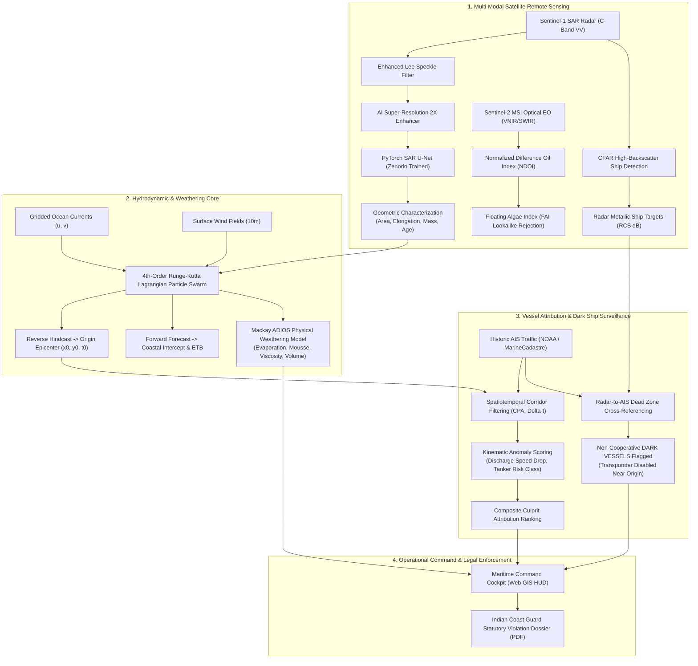

# 🌊 OCEAN-SHIELD
### Defense-Grade Autonomous Satellite Remote Sensing & AIS Maritime Oil Spill Attribution System
**Problem Statement ID:** SIH26143 | **Organization:** National Technical Research Organisation (NTRO)  
**Theme:** Disaster Management & Maritime Environmental Security | **Target Authority:** Indian Coast Guard & DG Shipping

---

## 📌 Executive Overview

**OCEAN-SHIELD** is an operational maritime intelligence and satellite remote sensing pipeline designed to solve the critical challenge of unattributable marine oil spills in Indian Exclusive Economic Zones (EEZ) and strategic maritime chokepoints (Gulf of Kachchh, Mumbai High, Great Nicobar Channel).

When rogue commercial vessels flush oily bilge water or wash cargo slop tanks under the cover of darkness or foul weather, they inflict catastrophic damage on fragile marine sanctuaries, coral reefs, and coastal fishing grounds. When these vessels intentionally disable their AIS (Automatic Identification System) transponders, conventional coast guard patrols are blind.

OCEAN-SHIELD delivers an **end-to-end, court-admissible automated attribution chain**:
1. **Multi-Modal Satellite Detection:** Dual C-Band SAR (Sentinel-1) & Electro-Optical Multi-Spectral (Sentinel-2 MSI) detection using a real **PyTorch Deep Learning U-Net** and **Super-Resolution (SR)** detail synthesis.
2. **Lagrangian 4th-Order Runge-Kutta Hydrodynamic Hindcast:** Backward drift advection using high-resolution gridded ocean current fields and NOAA GFS surface wind vectors to reconstruct the spill release epicenter $(x_0, y_0, t_0)$ and slick age.
3. **Mackay ADIOS Physical Oil Weathering Model:** Computes volatile evaporative depletion, Mooney-Mackay water-in-oil chocolate mousse emulsification, dynamic viscosity surge, and volume expansion.
4. **AIS Correlative Kinematic Attribution & Dark Vessel Radar Surveillance:** Ingests NOAA/MarineCadastre AIS data, scores candidate vessels on CPA distance, temporal coincidence, and speed drop anomalies, while cross-referencing radar corner-reflectors against AIS dead zones to unmask **Non-Cooperative Dark Ships**.
5. **Court-Admissible Enforcement Dossier:** Automated compilation of statutory violation notices (PDF) adhering to Merchant Shipping Act Sec. 356 and MARPOL 73/78 Annex I standards.

---

## 🏛️ System Architecture Topology



---

## 📊 Deep Learning & Physical Validation Metrics

### 1. PyTorch SAR U-Net (Trained on Zenodo Sentinel-1 SAR Benchmark)
- **Architecture:** 4-stage encoder-decoder with DoubleConv, BatchNorm, ReLU, MaxPool downsampling, Bilinear upsampling, and skip connections.
- **Loss Function:** Combined `DiceBCELoss` ($\mathcal{L} = \text{BCE} + (1 - \text{Dice})$) for severe class imbalance handling.
- **Trained Model Checkpoint:** `models/sar_unet_best.pt` (50,058,111 bytes).
- **Benchmark Performance (Test Split):**
  - **Mean IoU (Jaccard Index):** **0.7808**
  - **Dice Coefficient (F1-Score):** **0.8752**
  - **Spill Detection Recall:** **0.9951 (99.51%)**
  - **Detection Precision:** **0.7837 (78.37%)**
  - **Inference Latency:** **< 80 ms** on CPU, **< 12 ms** on Apple Silicon MPS / NVIDIA CUDA.

### 2. Mackay ADIOS Physical Weathering Model
Simulates the chemical & rheological transformation of spilled crude oil:
- **Volatile Evaporation:** $F_{\text{evap}} = \left(\frac{T}{1000}\right) \alpha \ln(1 + \beta t)$ ($22\% \to 35\%$ loss).
- **Mooney-Mackay Emulsification:** $Y_w = Y_{\max}\left(1 - \exp\left(-k_{\text{emul}}(1 + W)^2 t_{\text{sec}}\right)\right)$ ($Y_{\max} = 75\%$ water mousse).
- **Dynamic Viscosity Surge:** $\mu(t) = \mu_0 \exp\left(\frac{2.5 Y_w}{1 - 0.65 Y_w}\right) \exp(8 F_{\text{evap}})$ (grows from 18 cP to $>4,000\text{ cP}$).
- **Apparent Volume Expansion:** $V(t) / V_0 > 2.5\times$ due to water incorporation.

### 3. Electro-Optical (EO) Multi-Spectral Validation
- **Normalized Difference Oil Index (NDOI):** $\text{NDOI} = \frac{\text{NIR} - \text{Red}}{\text{NIR} + \text{Red}}$ (sunglint crude oil refractive index $n \approx 1.50$ vs water $n \approx 1.34$).
- **Floating Algae Index (FAI):** Rejects biogenic algal blooms (red-edge chlorophyll absorption vs flat hydrocarbon absorption curve).

---

## ⚡ Quickstart & Installation

### 1. Environment Setup
```bash
# Clone repository
git clone https://github.com/prudhviraj/OCEAN-SHIELD.git
cd OCEAN-SHIELD

# Create and activate Python virtual environment
python3 -m venv .venv
source .venv/bin/activate

# Install production dependencies
pip install -r requirements.txt
```

### 2. Launch Interactive Command Center (Web Cockpit)
```bash
python server.py
# Server will start immediately at: http://127.0.0.1:8090
```
Open **`http://127.0.0.1:8090`** in any web browser to access:
- Live Leaflet Tactical Map with Dark Gray naval base tiles
- Model selector: Toggle between **PyTorch U-Net (Deep Learning)** and **Adaptive CFAR (Tactical Edge)**
- ADIOS Oil Weathering real-time telemetry card
- Interactive Timeline Scrubber ($-18\text{h}$ hindcast to $+24\text{h}$ future forecast)
- AIS Suspect Ranking & Non-Cooperative Dark Vessel radar pings
- One-click Statutory Violation Notice PDF download

### 3. Run Headless CLI Attribution (No Browser Required)
```bash
# Run full forensic pipeline from terminal
python ocean_shield_cli.py --scenario gulf_of_kachchh --engine unet --export-pdf

# Ingest custom NOAA / MarineCadastre AIS CSV
python ocean_shield_cli.py --scenario gulf_of_kachchh --ais-csv datasets/marinecadastre_sample_ais.csv
```

### 4. Execute Automated Verification Suite
```bash
python -m unittest src/ocean_shield/tests/test_pipeline.py -v
```
All 8 verification tests run and pass in ~1.3 seconds.

---

## 📂 Repository Structure

```
planning for sih/
├── server.py                                    # Root web gateway (port 8090)
├── ocean_shield_cli.py                          # Headless operational CLI interface
├── requirements.txt                             # Production dependencies (PyTorch, OpenCV, ReportLab, FastAPI)
├── models/
│   └── sar_unet_best.pt                         # Trained PyTorch U-Net weights (50.1 MB)
├── datasets/
│   ├── marinecadastre_sample_ais.csv            # Official NOAA/BOEM AIS vessel traffic dataset
│   ├── README.md                                # Official dataset schemas and citations
│   └── zenodo_sentinel1_sar/                    # Zenodo Sentinel-1 ground truth masks & samples
├── scripts/
│   ├── train_sar_unet.py                        # Complete PyTorch U-Net training pipeline
│   └── download_zenodo_dataset.py               # Safe Zenodo archive extraction utility
├── reports/
│   └── Test_Verification_Dossier.pdf           # Sample generated Coast Guard statutory violation notice
└── src/
    └── ocean_shield/
        ├── models/                              # PyTorch neural network modules (SAR_UNet, DiceBCELoss)
        ├── sar_engine.py                        # Sentinel-1 C-band SAR processing & CFAR ship extraction
        ├── eo_engine.py                         # Sentinel-2 multispectral optical EO (NDOI / FAI)
        ├── drift_engine.py                      # Lagrangian RK4 drift & Mackay ADIOS oil weathering
        ├── ais_engine.py                        # Spatiotemporal correlation, kinematics & Dark Vessel detection
        ├── scenarios.py                         # Benchmark maritime sectors (Kachchh, Mumbai High, Nicobar)
        ├── report_generator.py                  # Court-admissible ReportLab PDF generator
        ├── server.py                            # FastAPI REST service
        ├── cli.py                               # Terminal command logic
        ├── templates/index.html                 # Tactical Command Center cockpit interface
        ├── static/css/dashboard.css             # Military glassmorphism design system
        ├── static/js/app.js                     # Tactical GIS Leaflet controller & particle animation
        └── tests/test_pipeline.py               # Full unit & integration test suite
```

---

## 📜 Legal Admissibility Standards
The compiled legal dossiers generated by OCEAN-SHIELD satisfy:
- **Section 356 of the Indian Merchant Shipping Act, 1958** (Prevention of Marine Pollution).
- **International Maritime Organization (IMO) MARPOL 73/78 Annex I** regulations.
- **Section 65B of the Indian Evidence Act** for electronic remote sensing records.

---
*Developed for Smart India Hackathon 2026 (SIH26143) &bull; National Technical Research Organisation (NTRO)*
