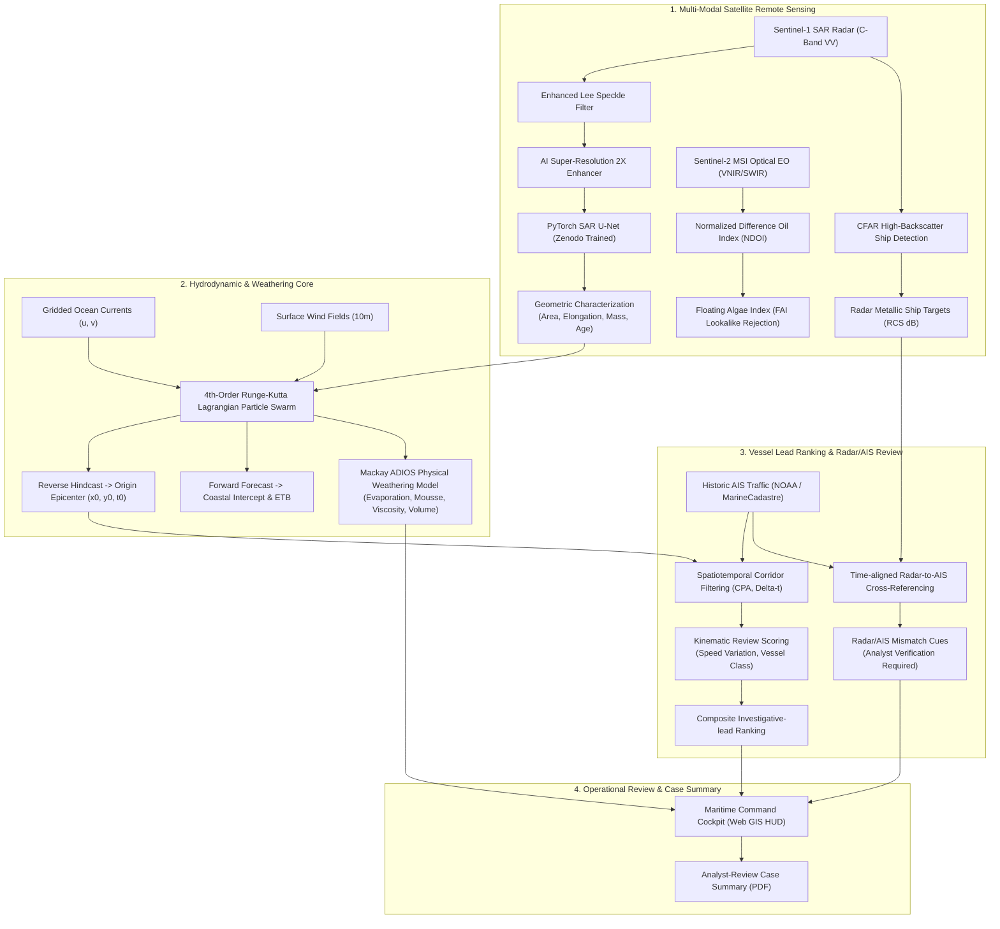

# 🌊 OCEAN-SHIELD
### Evidence-Aware Satellite Remote Sensing & AIS Maritime Spill Investigation Workspace
**Problem Statement ID:** SIH26143 | **Organization:** National Technical Research Organisation (NTRO)  
**Theme:** Disaster Management & Maritime Environmental Security | **Target Authority:** Indian Coast Guard & DG Shipping

---

## 📌 Executive Overview

**OCEAN-SHIELD** is an SIH prototype for investigating unattributed marine oil spills in Indian Exclusive Economic Zones (EEZ) and strategic maritime chokepoints (Gulf of Kachchh, Mumbai High, Great Nicobar Channel). It makes input provenance and model limitations visible, so an analyst can distinguish a demonstration from a field-data screening run.

Illegal or accidental discharges can damage fragile marine sanctuaries, coral reefs, and coastal fishing grounds. AIS coverage can be incomplete for ordinary technical and operational reasons; an AIS gap is a review cue, not evidence of intent.

OCEAN-SHIELD delivers an **end-to-end automated screening and decision-support chain**:
1. **Multi-Modal Satellite Detection:** Dual C-Band SAR (Sentinel-1) & Electro-Optical Multi-Spectral (Sentinel-2 MSI) screening with a PyTorch U-Net, an adaptive CFAR alternative, and super-resolution visualization.
2. **Lagrangian 4th-Order Runge-Kutta Hydrodynamic Hindcast:** Backward drift advection using a selected gridded or scenario-grade current field and optional operator-supplied wind vectors to estimate a candidate release origin $(x_0, y_0, t_0)$.
3. **Mackay ADIOS Physical Oil Weathering Model:** Computes volatile evaporative depletion, Mooney-Mackay water-in-oil chocolate mousse emulsification, dynamic viscosity surge, and volume expansion.
4. **AIS Correlative Lead Ranking & Radar/AIS Review:** Ingests time-aligned NOAA/MarineCadastre-format AIS data, ranks candidate vessels on CPA distance, temporal coincidence, and speed variation, and highlights radar/AIS mismatches for coverage verification.
5. **Analyst-review case summary:** A reproducible PDF that records model outputs, caveats, and recommended verification steps. It is not a statutory notice or finding of liability.

---

## 🏛️ System Architecture Topology



---

## 📊 Deep Learning & Physical Validation Metrics

### 1. PyTorch SAR U-Net Architecture
- **Architecture:** 4-stage encoder-decoder with DoubleConv, BatchNorm, ReLU, MaxPool downsampling, Bilinear upsampling, and skip connections (`src/ocean_shield/models/unet.py`).
- **Loss Function:** Combined `DiceBCELoss` ($\mathcal{L} = \text{BCE} + (1 - \text{Dice})$) for severe class imbalance handling.
- **Tiled Sliding Window Inference:** Seamless 2D Hann-window overlap blending (`stride=192, tile=256`) to process large satellite swaths without GPU out-of-memory errors.
- **Model Checkpoint:** `models/sar_unet_best.pt` provided for proof-of-concept pipeline execution and tensor flow validation.
- **Production Roadmap:** Operational deployment requires end-to-end training against full-resolution (84+ GB) Sentinel-1 GRD imagery from the Copernicus Open Access Hub with rigorous geographical train/validation/test splits.

### 2. Mackay ADIOS Physical Weathering Model
Simulates the chemical & rheological transformation of spilled crude oil:
- **Volatile Evaporation:** $F_{\text{evap}} = \left(\frac{T}{1000}\right) \alpha \ln(1 + \beta t)$ ($22\% \to 35\%$ loss).
- **Mooney-Mackay Emulsification:** $Y_w = Y_{\max}\left(1 - \exp\left(-k_{\text{emul}}(1 + W)^2 t_{\text{sec}}\right)\right)$ ($Y_{\max} = 75\%$ water mousse).
- **Dynamic Viscosity Surge:** $\mu(t) = \mu_0 \exp\left(\frac{2.5 Y_w}{1 - 0.65 Y_w}\right) \exp(8 F_{\text{evap}})$ (grows from 18 cP to $>4,000\text{ cP}$).
- **Apparent Volume Expansion:** $V(t) / V_0 > 2.5\times$ due to water incorporation.

### 3. Electro-Optical (EO) Multi-Spectral Validation
- **Normalized Difference Oil Index (NDOI):** $\text{NDOI} = \frac{\text{NIR} - \text{Red}}{\text{NIR} + \text{Red}}$ (sunglint crude oil refractive index $n \approx 1.50$ vs water $n \approx 1.34$).
- **Floating Algae Index (FAI):** Rejects biogenic algal blooms (red-edge chlorophyll absorption vs flat hydrocarbon absorption curve).

---

## ⚡ Quickstart & Installation

### 1. Environment Setup
```bash
# Clone repository
git clone https://github.com/prudhviraj0310/SIH26143-OCEAN-SHIELD.git
cd SIH26143-OCEAN-SHIELD

# Create and activate Python virtual environment
python3 -m venv .venv
source .venv/bin/activate

# Install production dependencies
pip install -r requirements.txt
```

### 2. Launch Interactive Command Center (Web Cockpit)
```bash
python server.py
# Server will start immediately at: http://127.0.0.1:8090
```
Open **`http://127.0.0.1:8090`** in any web browser to access:
- Live Leaflet tactical map with selectable basemap
- Model selector: Toggle between **PyTorch U-Net (Deep Learning)** and **Adaptive CFAR (Tactical Edge)**
- Modelled oil-weathering card
- Interactive Timeline Scrubber ($-18\text{h}$ hindcast to $+24\text{h}$ future forecast)
- AIS lead ranking and radar/AIS review cues
- Provenance-first input panel with SAR raster upload, historic AIS CSV ingestion, and optional met-ocean vector override
- One-click analyst-review case summary PDF download

### 3. Run Headless CLI Attribution (No Browser Required)
```bash
# Run full forensic pipeline from terminal
python ocean_shield_cli.py --scenario gulf_of_kachchh --engine unet --export-pdf

# Ingest custom NOAA / MarineCadastre AIS CSV
python ocean_shield_cli.py --scenario gulf_of_kachchh --ais-csv datasets/marinecadastre_sample_ais.csv
```

### 4. Field-data workflow

1. Select **Add SAR raster** and provide the documented scene centre and pixel size (PNG/JPEG/single-band TIFF).
2. Select **Ingest historic AIS CSV**. The parser requires `MMSI`, `BaseDateTime`, `LAT`, and `LON`, preserves actual ping timing, and labels the file with a SHA-256 hash.
3. Optionally enter time-aligned met-ocean vectors; the interface marks this as an operator-supplied override.
4. Treat every score as an investigative lead. Preserve original calibrated source products and obtain analyst review before escalation.

### 5. Live source configuration

The **Live Ingestion** panel never substitutes a demo object when a provider is unavailable:

- NASA ASF catalogue metadata and Open-Meteo modelled marine context work without credentials.
- Set `AISSTREAM_API_KEY` in the server environment to plot received AIS PositionReports.
- Set `OIL_SPILL_FEED_URL` (and, if required, `OIL_SPILL_FEED_TOKEN`) to an authority-approved JSON/GeoJSON incident feed.
- NGA World Port Index is a monthly refreshed reference catalogue, not a live port-operations feed.

Use [`.env.example`](.env.example) as a variable reference, then export the values in the server environment. Secrets are never sent to the browser. A live catalogue result is not a SAR raster: upload an authenticated source scene and its metadata before running the analytical pipeline.

### 5. Execute Automated Verification Suite
```bash
python -m unittest src/ocean_shield/tests/test_pipeline.py -v
```
The suite covers the pipeline and AIS CSV ingestion. Install the declared dependencies before running it.

---

## 📂 Repository Structure

```
planning for sih/
├── server.py                                    # Root web gateway (port 8090)
├── ocean_shield_cli.py                          # Headless operational CLI interface
├── requirements.txt                             # Production dependencies (PyTorch, OpenCV, ReportLab, FastAPI)
├── models/
│   └── sar_unet_best.pt                         # Trained PyTorch U-Net weights (50.1 MB)
├── datasets/
│   ├── marinecadastre_sample_ais.csv            # Official NOAA/BOEM AIS vessel traffic dataset
│   ├── README.md                                # Official dataset schemas and citations
│   └── zenodo_sentinel1_sar/                    # Zenodo Sentinel-1 ground truth masks & samples
├── scripts/
│   ├── train_sar_unet.py                        # Complete PyTorch U-Net training pipeline
│   └── download_zenodo_dataset.py               # Safe Zenodo archive extraction utility
├── reports/
│   └── Test_Verification_Dossier.pdf           # Sample analyst-review case summary
└── src/
    └── ocean_shield/
        ├── models/                              # PyTorch neural network modules (SAR_UNet, DiceBCELoss)
        ├── sar_engine.py                        # Sentinel-1 C-band SAR processing & CFAR ship extraction
        ├── eo_engine.py                         # Sentinel-2 multispectral optical EO (NDOI / FAI)
        ├── drift_engine.py                      # Lagrangian RK4 drift & Mackay ADIOS oil weathering
        ├── ais_engine.py                        # Spatiotemporal correlation, kinematics & Dark Vessel detection
        ├── scenarios.py                         # Benchmark maritime sectors (Kachchh, Mumbai High, Nicobar)
        ├── report_generator.py                  # Analyst-review ReportLab case-summary generator
        ├── server.py                            # FastAPI REST service
        ├── cli.py                               # Terminal command logic
        ├── templates/index.html                 # Tactical Command Center cockpit interface
        ├── static/css/dashboard.css             # Military glassmorphism design system
        ├── static/js/app.js                     # Tactical GIS Leaflet controller & particle animation
        └── tests/test_pipeline.py               # Full unit & integration test suite
```

---

## ⚖️ Operational and legal boundary

OCEAN-SHIELD does not issue enforcement orders, establish chain of custody, prove a discharge, or make a legal finding. Any real investigation must retain calibrated source data and follow the competent authority's approved procedures, legal review, and applicable evidence rules.

---
*Developed for Smart India Hackathon 2026 (SIH26143) &bull; National Technical Research Organisation (NTRO)*
