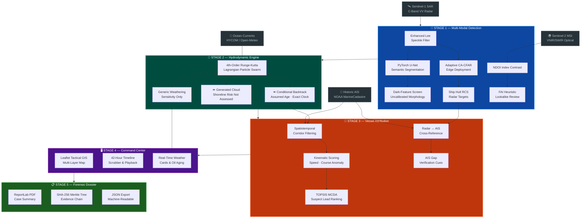

<div align="center">

<br>

# 🌊 OCEAN-SHIELD

### 🛡️ Evidence-Aware Satellite Remote Sensing & AIS Maritime Spill Investigation Workspace

*Research screening of satellite dark features, conditional transport and AIS corridors — not a responsibility finding.*


<br>

<!-- Badges Row 1: Identity -->
<a href="https://www.sih.gov.in/"></a>
<a href="#"></a>
<a href="#"></a>

<br>

<!-- Badges Row 2: Tech Stack -->


<br>

<!-- Badges Row 3: Metrics -->


<a href="LICENSE"></a>
<a href="LICENSE"></a>


<br>

---

**[🚀 Quick Start](#-quickstart)** · **[🏗️ Architecture](#%EF%B8%8F-system-architecture)** · **[🧠 AI/ML Models](#-deep-learning--physical-science-models)** · **[🗺️ Command Center](#%EF%B8%8F-maritime-command-center-ui)** · **[📊 API Reference](#-api-reference)** · **[🐳 Deploy](#-deployment)** · **[📚 Datasets](#-datasets--data-provenance)**

---

</div>

<br>

## 🔍 The Problem

> **Research use only — NOT CERTIFIED (4 October 2026).** Dark-feature extraction does not prove oil identity, thickness, mass or age. Reverse advection and KDE describe generated clouds conditioned on user assumptions, not calibrated origin probabilities. Missing coverage, source failures, invalid telemetry and failed sensitivity checks reach the final evidence hold. No Bayesian, court-admissibility, flight/shoreline safety or agency-readiness claim follows from passing regression tests.

> **SIH26143 — National Technical Research Organisation (NTRO)**  
> *"Develop a system for detection and tracking of oil spills using satellite imagery, identifying the source vessel responsible for the spill."*

Every year, **hundreds of illegal oil discharges** go unattributed in India's Exclusive Economic Zone. A tanker dumps bilge slop at 3 AM, AIS transponders conveniently go dark, and by dawn the evidence has drifted 40 nautical miles from the discharge point. The spill hits coral reefs, fishing grounds, and mangrove ecosystems before anyone can identify who did it.

**The challenge isn't detection — it's attribution.** Existing solutions can spot a dark patch on a satellite image. None of them can:
- Run the physics **backwards** to find where the oil came from
- Cross-reference that origin against **every vessel** that was there
- Rank suspects using **multi-criteria decision analysis**
- Generate a **forensic-grade dossier** with tamper-evident hash chains

OCEAN-SHIELD implements conditional screening and analyst summaries. It does not establish an actual release origin, exhaustively observe every vessel, or certify legal evidence. Runtime depends on hardware, inputs and source providers; no universal completion-time guarantee is established.

<br>

## 🏗️ System Architecture

The pipeline processes intelligence through **5 sequential stages**, each feeding the next. No stage operates in isolation — this is a closed-loop system.



<br>

## 🧠 Deep Learning & Physical Science Models

### Stage 1 · PyTorch SAR U-Net — Satellite Oil Spill Segmentation

A custom encoder-decoder architecture with skip connections. A local checkpoint alone does not demonstrate independent oil-label training or calibration. Model loading requires the project's validation record; independently authenticated holdout performance remains to be established. The historic claim of training on 1,200 annotated Zenodo scenes is not evidence of this checkpoint's actual training provenance.

```
Input (1×256×256)
  │
  ├── Encoder: DoubleConv(1→32) → Down(32→64) → Down(64→128) → Down(128→256) → Down(256→256)
  │                                                                                    │
  │   ┌────────────────────────────────────────────────────────────────────────────────┘
  │   │
  ├── Decoder: Up(512→128) → Up(256→64) → Up(128→32) → Up(64→32) → OutConv(32→1) → Sigmoid
  │
Output: Uncalibrated segmentation activation/mask (1×256×256)
```

| Component | Implementation |
|:---|:---|
| **Architecture** | 4-stage encoder-decoder, DoubleConv blocks, BatchNorm, ReLU, MaxPool2d↓, Bilinear↑ |
| **Skip Connections** | Feature concatenation at each decoder stage with dynamic padding |
| **Loss Function** | $\mathcal{L} = \text{BCE}(p, y) + 1 - \frac{2 \sum p \cdot y + \epsilon}{\sum p + \sum y + \epsilon}$ (Dice + BCE for class imbalance) |
| **Inference** | Tiled sliding window (256×256 tiles, stride=192) with 2D Hann-window blending |
| **Display Preview** | Deterministic bicubic when no validated checkpoint is available; interpolated display pixels are not new observations or native radiometry |
| **Speckle Filtering** | Enhanced Lee filter with adaptive local statistics and edge-preserving kernels |
| **Ship Detection** | 2D CA-CFAR (Cell-Averaging Constant False Alarm Rate) for metallic hull RCS extraction |

### Stage 2 · Lagrangian Hydrodynamic Drift Engine

Per-particle RK4 evaluates all particles at every stage. Fractional final steps preserve the actual clock. Reverse advection is conditional on forcing, age and spread assumptions; stochastic forward diffusion is not inverted into origin confidence. Provider failures propagate rather than silently supplying base vectors.

```
Particle Swarm (N=1000 virtual oil particles)
     │
     ▼
┌─────────────────────────────────────────────────┐
│  4th-Order Runge-Kutta Integration              │
│                                                 │
│  k₁ = Δt · V(xₙ, tₙ)                          │
│  k₂ = Δt · V(xₙ + k₁/2, tₙ + Δt/2)           │
│  k₃ = Δt · V(xₙ + k₂/2, tₙ + Δt/2)           │
│  k₄ = Δt · V(xₙ + k₃, tₙ + Δt)               │
│                                                 │
│  xₙ₊₁ = xₙ + (k₁ + 2k₂ + 2k₃ + k₄) / 6      │
│                                                 │
│  V(x,t) = V_current(x,t) + 0.03·V_wind(x,t)   │
│         + stochastic_diffusion(κ)               │
└─────────────────────────────────────────────────┘
     │
      ├── REVERSE: Conditional terminal cloud under an explicitly supplied age
     │
      └── FORWARD: Conditional generated cloud; shoreline/asset risk unassessed
```

**Coastline boundary:** Approximate polygon/latitude checks are demonstration cues only. They do not validate real coastlines, beaching times or protected-asset clearance. Reported shoreline status is `NOT_ASSESSED`.

### Stage 2b · Generic Weathering Sensitivity

Illustrates mass-fraction and volume bookkeeping with supplied environmental/oil priors. It is not ADIOS-equivalent, an oil-specific forecast or a measured mass estimate. Weathering is unassessed when mass/profile are absent. The following formulas describe project assumptions, not field validation:

| Process | Equation | Physical Effect |
|:---|:---|:---|
| **Volatile Evaporation** | $F_{\text{evap}} = \frac{T}{1000} \cdot \alpha \cdot \ln(1 + \beta \cdot t)$ | 22% → 35% mass loss |
| **Mooney-Mackay Emulsification** | $Y_w = Y_{\max}\left(1 - e^{-k_e(1+W)^2 t}\right)$ | Water-in-oil "chocolate mousse" (75% $Y_{\max}$) |
| **Dynamic Viscosity Surge** | $\mu(t) = \mu_0 \cdot e^{2.5Y_w/(1-0.65Y_w)} \cdot e^{8F_{\text{evap}}}$ | 18 cP → 4,000+ cP |
| **Volume Expansion** | $V(t)/V_0 > 2.5\times$ | Apparent volume growth from water uptake |

### Stage 3 · Multi-Criteria Vessel Attribution

Ranks proximity (60%) and time coincidence (40%) for review. Speed/course/type are context, not responsibility evidence. Scores and softmax weights are uncalibrated priority signals. The mandatory unknown-source baseline participates in every candidate-count distribution, full-precision entropy and margin.

Eligibility uses the project's inclusive entropy <=0.82 and margin >=0.15, plus complete telemetry, assessed integrity/sensitivity and independently assessed receiver coverage. These are screening rules, not a Bayesian calibration or measured false-accusation guarantee. The public API currently has no independent coverage evaluator, so evidentiary leads remain withheld.

**Radar/AIS mismatch:** Requires receiver-coverage review; absence of a match does not prove a disabled transponder.

### Stage 3b · Electro-Optical Multi-Spectral Validation

Supplied red/NIR/SWIR inputs produce heuristic index contrasts. Band names do not establish sensor authenticity or radiometric calibration. Confidence, biological identity and oil thickness remain unassessed; pseudo-NIR is explicitly derived RGB.

| Index | Formula | Purpose |
|:---|:---|:---|
| **NDOI** | $\frac{\text{NIR} - \text{Red}}{\text{NIR} + \text{Red}}$ | Oil refractive index contrast ($n_{\text{oil}} ≈ 1.50$ vs $n_{\text{water}} ≈ 1.34$) |
| **FAI** | Supplied-band index contrast | Heuristic lookalike-review cue, not biological identity |
| **OCI** | Optical Contrast Index | Appearance contrast, not oil thickness or emulsion classification |

### Research additions reviewed on 4 October 2026

These additions are useful research components, but none is an operational validation result:

| Addition | What the current code does | Status and interpretation |
|:---|:---|:---|
| **Scale-free dark-patch look-alike screen** (`src/ocean_shield/lookalike_screen.py`) | Computes darkness z-scores, texture/edge ratios, compactness, solidity and elongation, then combines them with fixed thresholds and a logistic score. Missing/masked local support or invalid features return `NOT_ASSESSED` with a null index, never a low-risk default. | **Experimental review cue.** The returned `screening_index` is not a calibrated probability, and no oil-confirmation field is emitted. Dimensionless features are not automatically invariant to nonlinear dB/linear transforms, clipping, quantisation or scene conditions. No held-out calibration result is claimed. |
| **Fay gravity–viscous spreading reference** (`estimate_fay_spill_age`) | Inverts a Fay-style $A\propto t^{1/2}$ relationship under declared volume, density, viscosity and $k_2$ assumptions. Direct helper calls can use disclosed defaults; SAR processing does not infer age from a hidden volume and returns `NOT_ASSESSED`. | **Conditional sensitivity only.** A single SAR area does not observe release volume, phase regime, weathering or release time. Inputs reject booleans, strings, non-finite values, non-positive densities/viscosity, and overflow-prone bounds. `regime_valid` is null and `regime_status=NOT_ASSESSED`; bounds are not confidence intervals or validated physical limits. No GNOME/ADIOS equivalence or measured-case calibration is established. |
| **Per-particle RK4 and exact clocks** | Evaluates provider forcing at each particle/stage and integrates fractional final steps. | **Useful numerical repair, not ocean-model validation.** Source coverage, forcing quality, diffusion assumptions and held-out transport validation remain open. |

The earlier pre-hardening witness produced `OIL_SLICK_CONFIRMED`/0.996 for one manufactured dark patch and 0.930 after a nonlinear intensity transform. The current code uses `CANDIDATE_HIGH_CONTRAST`/`LOOKALIKE_PRIORITY_LOW`/`AMBIGUOUS_INTERMEDIATE` and exposes `UNCALIBRATED_EXPERIMENTAL_HEURISTIC`. It remains a review feature until probability calibration and transform robustness are independently measured. See `reports/SIH-peer-advancements-review-2026-10-04.md` for the historical and current review.

<br>

## 🗺️ Maritime Command Center UI

A research dashboard built with **glassmorphism design language**, Leaflet GIS, and screening panels. Styling is not military qualification.

### Interface Panels

| Panel | Description |
|:---|:---|
| 🗺️ **Tactical GIS Map** | Multi-layer Leaflet map with SAR overlays, drift particle animations, vessel tracks, and risk contour heatmaps. Supports ESRI Satellite, OpenStreetMap, and Dark Matter basemaps |
| 📊 **SAR Analysis Card** | Uncalibrated dark-feature geometry, CFAR ship targets, experimental look-alike review and an interpolated display-preview toggle |
| 🌊 **Drift Simulation** | Interactive 42-hour timeline scrubber (−18h hindcast → +24h forecast) with particle swarm animation, speed toggles (1×/2×/4×), and milestone ticks |
| ⛽ **Weathering Sensitivity** | Generic supplied-profile scenario; no ADIOS equivalence or measured mass/age |
| 🚢 **Corridor Review** | Ranked review candidates with uncalibrated priority scores, evidence holds, CPA distances and navigation context |
| 📡 **Traffic Manager** | Optional AIS upload/live-provider surfaces, coverage disclaimers, review filtering and JSON summary export |
| 🛰️ **Live Ingestion** | NASA ASF satellite pass tracking, Open-Meteo marine weather, AISStream real-time transponders, and NGA World Port Index |
| 📋 **Case Export** | PDF analyst-review summary with source digests; hashes do not establish authenticity, custody or legal admissibility |

### Design System

- **Typography:** Inter (UI) + JetBrains Mono (data readouts)
- **Color Palette:** Deep navy (`#0a0e1a`) base with cyan accent (`#00f2fe`) and warm alert tones
- **Effects:** Backdrop-filter glassmorphism, CSS variable theming, hardware-accelerated particle animations
- **Modes:** Simple mode for judges, Advanced mode for operators

<br>

## 🚀 Quickstart

### Prerequisites
- Python 3.11+
- 512 MB RAM minimum (lazy model loading)
- Modern web browser (Chrome / Firefox / Edge)

### 1. Clone & Install

```bash
# Clone the repository
git clone https://github.com/prudhviraj0310/SIH26143-OCEAN-SHIELD.git
cd SIH26143-OCEAN-SHIELD

# Create virtual environment
python3 -m venv .venv
source .venv/bin/activate        # macOS / Linux
# .venv\Scripts\activate         # Windows

# Install dependencies (CPU-optimized PyTorch)
pip install -r requirements.txt
```

### 2. Launch the Command Center

```bash
python server.py
```

Open **http://127.0.0.1:8090** → Full tactical dashboard loads instantly.

### 3. Run Headless CLI (No Browser)

```bash
# Explicit, isolated research demo with a user-supplied age hypothesis
python ocean_shield_cli.py --demo --age-hours 10.5 --scenario gulf_of_kachchh --engine cfar_edge --export-pdf

# Source-backed AIS belongs in dated API ingestion, not the demo CLI.
# Use the dashboard's dated SAR/AIS upload forms; --ais-csv is refused in demo mode.

# List all available scenarios
curl http://127.0.0.1:8090/api/scenarios
```

### 4. Field-Data Workflow

```
Step 1 → Upload SAR raster (PNG/JPEG/single-band TIFF) with scene metadata
Step 2 → Ingest historic AIS CSV (MMSI, BaseDateTime, LAT, LON required)
         Parser preserves actual ping timing & labels file with SHA-256 hash
Step 3 → (Optional) Enter met-ocean vector overrides — clearly marked in UI
Step 4 → Review all scores as investigative leads, not findings of liability
```

### 5. Run Test Suite

```bash
HF_HUB_OFFLINE=1 TRANSFORMERS_OFFLINE=1 python -m unittest discover -s src/ocean_shield/tests -v
node src/ocean_shield/tests/test_ui_regressions.js
# Regression checks are not independent scientific validation.
```

<br>

## 📊 API Reference

All endpoints are served via **FastAPI** with automatic OpenAPI documentation at `/docs`.

| Method | Endpoint | Description |
|:---:|:---|:---|
| `GET` | `/` | Maritime Command Center UI |
| `GET` | `/api/health` | Health check (uptime, memory, model status) |
| `GET` | `/api/scenarios` | List all benchmark scenarios |
| `POST` | `/api/analyze-sar` | Process SAR image → slick detection + ship extraction |
| `POST` | `/api/simulate-drift` | Conditional transport with source/input gates |
| `POST` | `/api/correlate-ais` | AIS vessel correlation & suspect ranking |
| `POST` | `/api/analyze-eo` | Uncalibrated optical index screening |
| `POST` | `/api/export-case-summary` | Analyst-review summary preserving holds, not certified evidence |
| `POST` | `/api/upload-ais-csv` | Ingest MarineCadastre AIS CSV |
| `GET` | `/api/live/satellite-passes` | NASA ASF Sentinel-1 pass schedule |
| `GET` | `/api/live/ocean-weather` | Open-Meteo marine conditions |
| `GET` | `/api/live/ais-traffic` | Real-time AIS vessel positions |
| `GET` | `/api/live/ports` | NGA World Port Index query |
| `GET` | `/api/live/oil-spill-incidents` | Authority-approved spill feed |
| `GET` | `/api/live/provider-status` | Live data source health check |
| `GET` | `/techstack` | Interactive technology stack visualization |

<br>

## 🐳 Deployment

### Docker (Recommended)

```bash
# Single command deployment
docker compose up -d

# Or build manually
docker build -t ocean-shield .
docker run -p 8000:8000 --name ocean-shield-c2 ocean-shield
```

The container runs as an **unprivileged user** (`oceanshield:1001`) with health checks every 30 seconds.

### Render (One-Click Cloud)

The included `render.yaml` enables instant deployment on [Render](https://render.com):

```bash
# render.yaml is pre-configured with:
# - Python 3.11.9 runtime
# - CPU-optimized PyTorch
# - OMP/MKL thread optimization (saves ~50 MB RAM)
# - Keep-alive self-pinger for free tier
```

### Environment Variables

Copy `.env.example` and configure:

```bash
AISSTREAM_API_KEY=           # Real-time AIS transponder stream
OIL_SPILL_FEED_URL=          # Authority-approved spill incident feed
OIL_SPILL_FEED_TOKEN=        # Feed authentication token
CDSE_CLIENT_ID=              # Copernicus Data Space Ecosystem
CDSE_CLIENT_SECRET=          # (Reserved for future scene download)
```

> **Security:** Credentials are server-side only. Nothing is sent to the browser. The live ingestion panel never substitutes a demo object when a provider is unavailable.

<br>

## 📚 Datasets & Data Provenance

The entries below identify referenced or locally sampled sources. They do **not** claim that every archive is checked into this repository, that the local checkpoint was trained on every listed scene, or that any source is independently authenticated for a mission.

| Dataset | Source | Format | Size |
|:---|:---|:---|:---|
| **SAR oil-mask reference** | [Zenodo 8346860](https://zenodo.org/records/8346860) | Sentinel-1 GRD C-band VV reference | External reference; local training provenance and split are not asserted |
| **Look-alike reference** | [Zenodo 8253899](https://zenodo.org/records/8253899) | Algae/wind/current negative examples | External reference; not yet a calibration receipt for `lookalike_screen.py` |
| **Test benchmark reference** | [Zenodo 13761290](https://zenodo.org/records/13761290) | Held-out evaluation reference | External reference; no current model score is claimed here |
| **AIS Vessel Traffic** | [NOAA MarineCadastre](https://marinecadastre.gov/accessais/) | CSV: MMSI, BaseDateTime, LAT, LON, SOG, COG | 216 KB sample |
| **Ocean Currents** | [HYCOM](https://www.hycom.org/) / [Open-Meteo](https://open-meteo.com/) | NetCDF CF-compliant (water_u, water_v) | Runtime API |
| **Wind Fields** | [NOAA GFS](https://www.ncei.noaa.gov/products/weather-climate-models/global-forecast) / [ECMWF](https://www.ecmwf.int/) | 10m atmospheric vectors | Runtime API |
| **World Ports** | [NGA WPI](https://msi.nga.mil/Publications/WPI) | GIS query service | Monthly refresh |

### Benchmark Scenarios

Three strategically selected Indian maritime sectors with pre-configured environmental conditions:

| Scenario | Region | Significance |
|:---|:---|:---|
| `gulf_of_kachchh` | 22.4°N, 69.1°E | India's largest oil terminal corridor (Kandla, Mundra) |
| `mumbai_high` | 19.4°N, 71.4°E | Offshore ONGC drilling platforms, high vessel density |
| `great_nicobar` | 7.3°N, 93.8°E | Strategic strait, international shipping lanes |

<br>

## 📂 Repository Structure

```
SIH26143-OCEAN-SHIELD/
│
├── server.py                          # Root gateway (port 8090)
├── ocean_shield_cli.py                # Headless CLI interface
├── requirements.txt                   # Production dependencies
├── Dockerfile                         # Multi-stage container build
├── docker-compose.yml                 # Orchestrated deployment
├── render.yaml                        # Render cloud PaaS config
├── .env.example                       # Environment variable reference
│
├── models/
│   └── sar_unet_best.pt              # Local checkpoint; training/calibration provenance must be verified
│
├── datasets/
│   ├── marinecadastre_sample_ais.csv  # NOAA/BOEM AIS vessel traffic
│   ├── marinecadastre_real_ais.csv    # Extended real AIS dataset (216 KB)
│   ├── zenodo_sentinel1_sar/          # Zenodo ground truth masks & samples
│   ├── real_sar/                      # Real Sentinel-1 SAR scenes
│   ├── real_eo/                       # Real Sentinel-2 optical scenes
│   ├── ocean_met/                     # Cached meteorological data
│   └── README.md                      # Dataset schemas & citations
│
├── scripts/
│   ├── train_sar_unet.py             # Complete U-Net training pipeline
│   ├── train_espcn.py                # Super-resolution model training
│   ├── download_zenodo_dataset.py    # Safe Zenodo archive extraction
│   ├── download_real_data.py         # Real satellite data acquisition
│   ├── generate_test_assets.py       # Synthetic test data generator
│   └── setup_azure_vm.sh            # GPU VM provisioning script
│
├── reports/
│   └── Test_Verification_Dossier.pdf # Sample forensic case summary
│
└── src/ocean_shield/
    ├── server.py                      # FastAPI REST service (1,031 lines)
    ├── sar_engine.py                  # SAR processing & U-Net inference (696 lines)
    ├── drift_engine.py                # Lagrangian RK4 + conditional weathering/Fay reference
    ├── ais_engine.py                  # AIS correlation & dark vessel detection (618 lines)
    ├── eo_engine.py                   # Uncalibrated multi-spectral index screening
    ├── lookalike_screen.py             # Experimental scale-free dark-patch review features
    ├── ocean_data.py                  # NetCDF oceanographic data provider (506 lines)
    ├── live_fetcher.py                # Real-time data adapters (545 lines)
    ├── ais_ingestion.py               # MarineCadastre CSV parser (189 lines)
    ├── report_generator.py            # ReportLab PDF dossier builder (706 lines)
    ├── scenarios.py                   # Benchmark scenario definitions (1,668 lines)
    │
    ├── models/
    │   ├── unet.py                    # SAR_UNet + DiceBCELoss (128 lines)
    │   └── super_resolution.py        # Validated-checkpoint path or disclosed display interpolation
    │
    ├── templates/
    │   ├── index.html                 # Tactical Command Center (1,491 lines)
    │   └── techstack.html             # Technology stack showcase (1,042 lines)
    │
    ├── static/
    │   ├── css/dashboard.css          # Glassmorphism design system (3,911 lines)
    │   ├── js/app.js                  # GIS controller & particle engine (3,190 lines)
    │   └── img/                       # Presentation assets
    │
    └── tests/
        ├── test_pipeline.py           # Full integration suite
        ├── test_lookalike_screen.py  # Look-alike input/triage contracts
        ├── test_fay_spreading.py     # Fay domain/integration contracts
        ├── test_evidence_regressions.py # Evidence, AIS, SR and API holds
        ├── test_transport_regressions.py # RK4/provider/time contracts
        ├── test_optical_claim_regressions.py # Optical calibration claims
        ├── test_cli_regressions.py    # Null-safe demo CLI/PDF smoke tests
        ├── test_ui_regressions.js     # Dashboard method-level scenarios
        └── test_live_fetcher.py        # Live data adapter tests
```

<br>

## 🔬 Technical Differentiators

<table>
<tr>
<th width="33%">🔒 Evidence Integrity</th>
<th width="33%">🧪 Scientific Rigor</th>
<th width="33%">🧰 Prototype Engineering</th>
</tr>
<tr>
<td>

- SHA-256 digests/Merkle-style summaries identify supplied bytes; they do not prove custody or authenticity
- Every score labeled as "investigative lead" — never as a finding
- Input provenance visible at all times
- Analyst-review PDF generation that preserves unavailable/held states

</td>
<td>

- Lagrangian particle transport (not simple vector addition)
- RK4 integration (4th-order accuracy)
- Generic weathering sensitivity, not ADIOS-equivalent
- Approximate demonstration coastline cues; operational shore/asset risk unassessed

</td>
<td>

- Lazy model loading and bounded input paths
- Docker/health-check configuration exists, but deployment qualification is not claimed
- CPU/MPS/CUDA paths depend on installed runtime and workload
- No production capacity or multi-worker case-store guarantee

</td>
</tr>
</table>

<br>

## ⚡ Performance Characteristics

Historic latency estimates are not verified for the repaired code and are withdrawn as guarantees. Transport cost depends on provider batch support; scalar providers require four calls per particle per step. Source coverage, model loading, image size and hardware require workload-specific measurements. Regression timings do not establish production capacity.

<br>

## 🔐 Live Data Sources

| Provider | Data | Auth Required | Status |
|:---|:---|:---:|:---|
| **NASA ASF** | Sentinel-1 SAR pass schedule | ❌ | Catalogue metadata only |
| **Open-Meteo** | Marine weather, currents, waves | ❌ | Modelled marine context |
| **AISStream.io** | Real-time AIS positions | ✅ API Key | WebSocket stream |
| **NGA WPI** | World Port Index | ❌ | Monthly reference catalogue |
| **Custom Feed** | Oil spill incidents | ✅ Token | Authority-approved JSON/GeoJSON |
| **CDSE** | Copernicus scene download | ✅ OAuth2 | Reserved for future use |

> **Truthfulness guarantee:** The live ingestion module (`live_fetcher.py`) **never creates synthetic data**. A provider being unavailable is returned to the caller as-is — that is safer than making a demo look operational.

<br>

## ⚖️ Operational & Legal Boundary

> **OCEAN-SHIELD does not:**
> - Issue enforcement orders
> - Establish chain of custody for unverified source material
> - Prove a discharge occurred
> - Make a legal finding of liability
>
> Any real investigation must retain calibrated source data and follow the competent authority's approved procedures, legal review, and applicable evidence rules. Every automated score is an **investigative lead** requiring analyst verification.

<br>

## 🧪 Verification & Testing

```bash
# Run all Python regressions using installed dependencies
HF_HUB_OFFLINE=1 TRANSFORMERS_OFFLINE=1 python -m unittest discover -s src/ocean_shield/tests -v
node src/ocean_shield/tests/test_ui_regressions.js

# Test coverage includes:
# ✓ SAR segmentation & super-resolution
# ✓ Enhanced Lee speckle filtering
# ✓ CFAR ship detection
# ✓ U-Net tiled inference with Hann blending
# ✓ Lagrangian RK4 drift simulation
# ✓ Unassessed shoreline/asset status and explicit demo cues
# ✓ Generic weathering bookkeeping and input-domain checks
# ✓ AIS spatiotemporal correlation
# ✓ Dark vessel radar/AIS cross-reference
# ✓ Kinematic anomaly scoring
# ✓ Multi-criteria suspect ranking
# ✓ EO NDOI/FAI processing
# ✓ MarineCadastre CSV parsing
# ✓ PDF dossier generation
# ✓ Merkle tree hash chain integrity
# ✓ Scenario loading & validation
# ✓ Full end-to-end pipeline integration
```

Final verification on 4 October 2026: **133 Python tests passed, 0 failed/errors/skipped**, plus **10 JavaScript scenario groups**. Python network access was blocked during the full Ocean suite with zero attempted connections. The CFAR metrics and overlay now reuse the same requested segmentation; uploads disclose unverified freshness. Local Leaflet/system-font dependencies remove the dashboard's code/font CDN requirement, but source-backed map tiles still require network access. These are regression and contract checks, not independent SAR calibration, Fay validation, transport skill assessment or operational qualification. See `reports/SIH-final-demo-readiness-2026-10-04.md` and `reports/sih-final-ocean-full-20261004T120328383937Z.json` for actual checks and recording limits.

<br>

## 🛣️ Prototype Connectors and Screening Contracts

The named adapters below are project integration surfaces, not proof of live agency connectivity, measured source accuracy, certification or deployment readiness. Their configured sources and explicit unavailable results must be inspected before use.

- **Dataset download script** (`scripts/download_zenodo_dataset.py`) — an acquisition utility; a downloaded archive is not a training or validation receipt.
- **INCOIS/CMEMS adapter surface** (`INCOIS_CMEMS_OPeNDAP_Adapter`) — code path exists; live connectivity, source authorization and forcing accuracy require a separate test.
- **Oceansat-3 adapter surface** (`Oceansat3_OCM_Adapter`) — code path exists; sensor authenticity and index validation are not established by this repository.
- **Multi-spill conditional analysis** (`track_multi_spill_shared_origin`) — generated-cloud proximity only; it does not identify sequential discharge corridors.
- **Responsive dashboard styling** — browser presentation capability; not shipboard qualification.
- **VTMS adapter surface** (`ICG_VTMS_Adapter`) — parser/integration surface; no live Coast Guard connection or operational authorization is claimed.
- **No automatic MARPOL/legal finding:** Navigation cues do not measure discharge, concentration, rate or responsibility.
- **Heuristic evidence hold:** `FalsificationAndAbstentionEngine` computes full-distribution entropy and margins, includes unknown sources and propagates source/integrity/sensitivity holds. It is neither Bayesian inference nor a legal adjudicator.
- [x] **Adversarial Self-Falsification Stress Testing** (evaluates 4 physical challenges: $\pm 20\%$ ocean current perturbations, $\pm 1.0\%$ wind leeway variation, $\pm 1.0$ NM GPS transponder jitter, and kinematic AIS continuity).

<br>

## 📖 References & Citations

<details>
<summary><strong>Click to expand full reference list</strong></summary>

1. **Zenodo Sentinel-1 SAR Oil Spill Dataset** — [Part I](https://zenodo.org/records/8346860) · [Part II](https://zenodo.org/records/8253899) · [Part III](https://zenodo.org/records/13761290)
2. **NOAA MarineCadastre AIS Data** — [marinecadastre.gov/accessais](https://marinecadastre.gov/accessais/)
3. **Mackay, D. et al.** (1980). "Oil Spill Processes and Models." *Environment Canada Report EE-8*
4. **Ronneberger, O. et al.** (2015). "U-Net: Convolutional Networks for Biomedical Image Segmentation." *MICCAI 2015*
5. **HYCOM Consortium** — [hycom.org](https://www.hycom.org/) — Hybrid Coordinate Ocean Model
6. **Open-Meteo Marine API** — [open-meteo.com](https://open-meteo.com/) — Open-source weather & ocean data
7. **NGA World Port Index** — [msi.nga.mil](https://msi.nga.mil/Publications/WPI)
8. **IMO MARPOL Convention** — Annex I: Regulations for the Prevention of Pollution by Oil
9. **Indian Coast Guard** — Marine Environment Protection Directorate
10. **INCOIS** — Indian National Centre for Ocean Information Services
11. **Brekke & Solberg (2005)** — oil-spill look-alike context, *Remote Sensing of Environment* 95(1), 1–13. The current fixed logit is not a reproduction or calibration of that literature.
12. **Solberg et al. (2007)** — SAR look-alike discrimination context, *IEEE TGRS*. The cited work does not validate this repository's hand-set thresholds.
13. **Fay (1971)** — gravity–viscous spreading reference. The current inversion is an assumption-driven sensitivity calculation, not a release-time measurement.

</details>

<br>

---

## ⚖️ Copyright & License

```text
Copyright (c) 2026 Prudhvi Raj & The Ocean Shield Team. All rights reserved.
```

This software and its documentation are an **independent research implementation** for **Smart India Hackathon 2026**, Problem Statement **SIH26143**. NTRO is named in the problem-statement context; this does not establish affiliation, guidance, endorsement or certification of this implementation by NTRO, the Indian Coast Guard or DG Shipping.

Licensed under the **Apache License, Version 2.0** (the "License"); you may not use this file except in compliance with the License. You may obtain a copy of the License in the [LICENSE](LICENSE) file or at:

[http://www.apache.org/licenses/LICENSE-2.0](http://www.apache.org/licenses/LICENSE-2.0)

Unless required by applicable law or agreed to in writing, software distributed under the License is distributed on an "AS IS" BASIS, WITHOUT WARRANTIES OR CONDITIONS OF ANY KIND, either express or implied. See the License for the specific language governing permissions and limitations under the License.

### Intellectual Property & Third-Party Attribution
* **Project Attribution:** The implementation is maintained by **Prudhvi Raj & The Ocean Shield Team © 2026**. U-Net, CFAR, RK4, TOPSIS, entropy and other published methods retain their original scholarly attribution; their presence does not establish scientific or legal validation of this application.
* **Satellite & Radar Datasets:**
  * **Copernicus Sentinel-1 SAR & Sentinel-2 MSI:** © European Space Agency (ESA) and the European Commission.
  * **Zenodo Sentinel-1 SAR Oil Spill Benchmark:** Open dataset for maritime environmental monitoring under Creative Commons CC-BY 4.0.
* **Hydrodynamic & Oceanographic Data:**
  * **HYCOM GOFS 3.1 & NOAA Fleet Numerical:** Global Ocean Data Assimilation Experiment.
  * **INCOIS (Indian National Centre for Ocean Information Services):** Real-time Indian Ocean sea surface currents, sea surface temperature, and wave forecasts.
  * **NOAA MarineCadastre:** Automated Identification System (AIS) vessel transponder archives.

<br>

---

<div align="center">

<br>

**Built for [Smart India Hackathon 2026](https://www.sih.gov.in/)** · Problem Statement SIH26143

**Independent research prototype · Not agency-endorsed · Not certified**

<br>

*"The ocean remembers every discharge. OCEAN-SHIELD reads those memories."*

<br>


</div>
