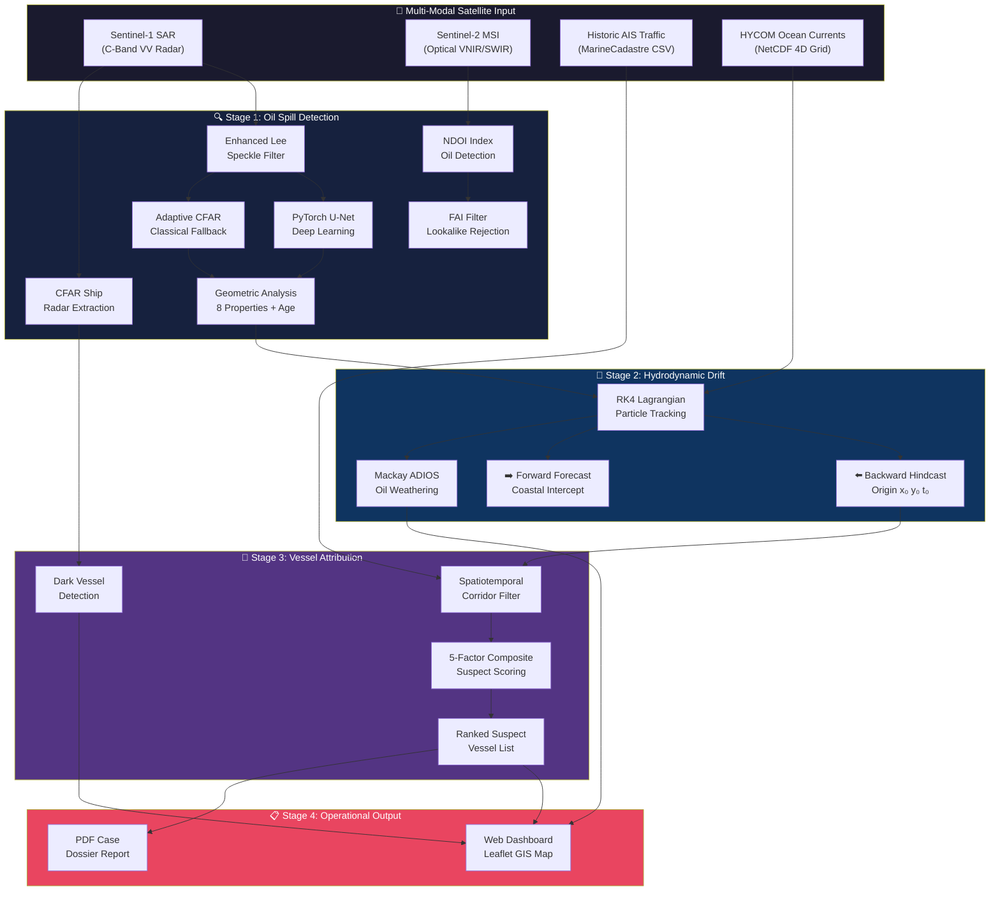

<p align="center">
  
  
  
  
</p>

<h1 align="center">🛡️ OCEAN-SHIELD</h1>
<h3 align="center">Satellite SAR & Optical EO Oil Spill Detection · Hydrodynamic Hindcast · AIS Rogue Vessel Attribution</h3>

<p align="center">
  <strong>An end-to-end automated pipeline that detects marine oil spills from satellite imagery, traces them backward to their origin using ocean physics, and identifies the responsible vessel using AIS data correlation.</strong>
</p>

<p align="center">
  
  
  
  
  
</p>

---

## 📌 Problem Statement

> **SIH26143:** *"Leveraging satellite imagery to determine Oil spills at sea along with AIS data correlations to identify vessel responsible for the spill."*
>
> — National Technical Research Organisation (NTRO), Smart India Hackathon 2026

When rogue commercial vessels flush oily bilge water or wash cargo slop tanks under cover of darkness, they inflict catastrophic damage on marine ecosystems. When they disable AIS transponders, conventional coast guard patrols are blind. **OCEAN-SHIELD** automates the entire investigation chain — from satellite pixel to suspect vessel.

---

## 🏛️ System Architecture



---

## ⚡ Quickstart

### 1. Install
```bash
git clone https://github.com/prudhviraj0310/SIH26143-OCEAN-SHIELD.git
cd SIH26143-OCEAN-SHIELD

python3 -m venv .venv && source .venv/bin/activate
pip install -r requirements.txt
```

### 2. Launch Dashboard
```bash
python server.py
# → http://127.0.0.1:8090
```

### 3. Run CLI Pipeline
```bash
python ocean_shield_cli.py --scenario gulf_of_kachchh --engine unet --export-pdf
```

### 4. Run Tests
```bash
PYTHONPATH=. python -m unittest src.ocean_shield.tests.test_pipeline -v
# 11/11 tests pass in ~7 seconds
```

---

## 🔌 REST API Reference

All endpoints served by FastAPI with auto-generated OpenAPI docs at `/docs`.

| Method | Endpoint | Description |
|--------|----------|-------------|
| `GET` | `/` | Web dashboard (Leaflet.js tactical map) |
| `GET` | `/api/health` | System health check |
| `GET` | `/api/scenarios` | List all pre-configured maritime scenarios |
| `GET` | `/api/scenario/{id}` | Full scenario details + SAR image (base64) |
| `POST` | `/api/analyze-sar` | Run SAR oil spill detection (U-Net or CFAR) |
| `POST` | `/api/analyze-sar-upload` | Upload custom SAR raster for analysis |
| `POST` | `/api/analyze-eo` | Run multispectral EO detection (NDOI/FAI) |
| `POST` | `/api/simulate-drift` | Run hindcast + forecast drift simulation |
| `POST` | `/api/correlate-ais` | AIS vessel attribution & suspect ranking |
| `GET` | `/api/export-dossier/{id}` | Download PDF case dossier |
| `POST` | `/api/export-case-summary` | Generate custom PDF case summary |
| `POST` | `/api/upload-ais-csv` | Ingest MarineCadastre AIS CSV data |

---

## 🧠 Technical Deep Dive

### SAR Oil Spill Detection (Dual Pipeline)

| Engine | Method | File |
|--------|--------|------|
| **PyTorch U-Net** | 4-stage encoder-decoder with DoubleConv, BatchNorm, skip connections. Tiled Hann-window blending for large swaths. | `src/ocean_shield/models/unet.py` |
| **Adaptive CFAR** | Constant False Alarm Rate segmentation with Enhanced Lee speckle filter. | `src/ocean_shield/sar_engine.py` |
| **ESPCN Super-Resolution** | Sub-Pixel CNN that enhances SAR imagery 2x before detection. | `src/ocean_shield/models/super_resolution.py` |

### Geometric Properties Computed
`area_km²` · `perimeter_km` · `elongation` · `orientation_deg` · `complexity_index` · `estimated_volume_m³` · `estimated_mass_tonnes` · `polygon_geojson`

### Slick Age Estimation
Fay's 3-Stage Spreading Theory (Fay 1971, Lehr 1984, Mackay 1980) with Mackay wind shear correction. Bounds: 0.5h – 48h.

### Lagrangian Drift Engine
- **4th-Order Runge-Kutta** (RK4) advection with 4-stage velocity evaluation
- 1000-particle Monte Carlo ensemble with turbulent diffusion
- 3.2% Stokes wind drift + 15° Ekman deflection
- Dispersion tensor minimization to locate origin
- HYCOM NetCDF ingestion + analytical tidal fallback

### AIS Vessel Attribution Scoring

```
Score = 0.35 × S_proximity + 0.25 × S_temporal + 0.20 × S_speed + 0.10 × S_course + 0.10 × S_type
```

| Factor | Method |
|--------|--------|
| **Proximity** | Gaussian spatial decay |
| **Temporal** | Gaussian time decay from origin t₀ |
| **Speed Anomaly** | Slow-speed discharge profile (2–5 kn) |
| **Course Anomaly** | Zigzag / erratic heading detection |
| **Vessel Type** | Risk weighting (Tanker > Bulk > Container) |
| **AIS Gap** | +15 penalty for transponder blackout > 45 min |

Suspects tiered: 🔴 HIGH-PRIORITY · 🟡 MEDIUM-PRIORITY · 🟢 LOW-PRIORITY

### Mackay ADIOS Oil Weathering
- Volatile evaporation (22% → 35% mass loss)
- Mooney-Mackay emulsification (up to 75% water mousse)
- Dynamic viscosity surge (18 cP → 4,000+ cP)
- Volume expansion (> 2.5x from water incorporation)

---

## 📂 Repository Structure

```
SIH26143-OCEAN-SHIELD/
├── server.py                       # Root web gateway (port 8090)
├── ocean_shield_cli.py             # Headless CLI interface
├── requirements.txt                # Dependencies
│
├── models/
│   ├── sar_unet_best.pt            # Trained U-Net weights
│   └── sar_espcn_best.pt           # ESPCN SR weights
│
├── datasets/
│   ├── marinecadastre_*.csv        # NOAA AIS vessel traffic
│   ├── ocean_met/                  # HYCOM NetCDF ocean currents
│   ├── real_sar/                   # Sentinel-1 SAR samples
│   └── real_eo/                    # Sentinel-2 multispectral
│
├── scripts/
│   ├── train_sar_unet.py           # U-Net training pipeline
│   ├── train_espcn.py              # ESPCN training pipeline
│   └── download_real_data.py       # Dataset download utility
│
├── reports/                        # Generated PDF dossiers
│
└── src/ocean_shield/
    ├── models/
    │   ├── unet.py                 # SAR_UNet + DiceBCELoss
    │   └── super_resolution.py     # ESPCN sub-pixel CNN
    ├── sar_engine.py               # SAR detection — 653 lines
    ├── eo_engine.py                # EO detection — 221 lines
    ├── drift_engine.py             # RK4 drift + ADIOS — 483 lines
    ├── ais_engine.py               # AIS attribution — 449 lines
    ├── ocean_data.py               # HYCOM provider — 434 lines
    ├── scenarios.py                # 6 Indian Ocean scenarios
    ├── ais_ingestion.py            # MarineCadastre CSV parser
    ├── report_generator.py         # PDF generator — 476 lines
    ├── server.py                   # FastAPI REST — 595 lines
    ├── templates/index.html        # Dashboard (417 lines)
    ├── static/css/dashboard.css    # CSS (938 lines)
    ├── static/js/app.js            # Leaflet.js (1065 lines)
    └── tests/test_pipeline.py      # 11 tests (296 lines)
```

**Total: ~3,300 lines core Python · ~2,400 lines frontend**

---

## 🧪 Test Suite (11/11 Passing)

| # | Test | Validates |
|---|------|-----------|
| 1 | `test_sar_engine_segmentation_and_super_resolution` | Lee filter, CFAR segmentation, SR enhancement |
| 2 | `test_pytorch_unet_deep_learning_pipeline` | Real PyTorch U-Net architecture and inference |
| 3 | `test_tiled_sliding_window_unet_inference` | Hann-window overlap for large scenes |
| 4 | `test_eo_engine_optical_multispectral_processing` | NDOI/FAI detection + lookalike rejection |
| 5 | `test_drift_engine_hindcast_and_forecast` | Reverse + forward Lagrangian drift |
| 6 | `test_adios_physical_oil_weathering_model` | Evaporation, emulsification, viscosity |
| 7 | `test_ais_correlation_and_culprit_attribution` | Corridor filter + scoring + ranking |
| 8 | `test_radar_ship_detection_and_ais_review_cues` | CFAR ship extraction + radar/AIS correlation |
| 9 | `test_marinecadastre_ais_csv_ingestion` | Time-preserving CSV parsing |
| 10 | `test_real_hycom_netcdf_ingestion_and_provenance` | NOAA HYCOM NetCDF ingestion |
| 11 | `test_all_scenarios_and_dossier_pdf` | End-to-end pipeline + PDF generation |

---

## 📊 Data Sources

| Dataset | Source | Usage |
|---------|--------|-------|
| Sentinel-1 SAR GRD | ESA Copernicus | C-Band radar oil detection |
| Sentinel-2 MSI L2A | ESA Copernicus | Optical multispectral validation |
| HYCOM GOFS 3.1 | NOAA / INCOIS | Ocean surface currents |
| AIS Vessel Traffic | MarineCadastre.gov | Historic vessel positions |
| GFS Surface Winds | NOAA NCEP | Wind vectors for Stokes drift |

---

## 🛠️ Tech Stack

| Layer | Technology |
|-------|-----------|
| Deep Learning | PyTorch 2.0+, U-Net, ESPCN |
| Computer Vision | OpenCV 4.8+ |
| Numerical Physics | NumPy, SciPy |
| Ocean Data | netCDF4 |
| Backend | FastAPI + Uvicorn |
| Frontend | HTML5, Vanilla JS, Leaflet.js, CSS3 |
| PDF Reports | ReportLab |
| Testing | Python unittest |

---

## ⚖️ Legal Boundary

> OCEAN-SHIELD is a **decision-support screening tool**, not an enforcement system. Every score is an investigative lead. Real investigations must retain calibrated source data and follow approved procedures with legal review.

---

<p align="center">
  <strong>Smart India Hackathon 2026 (SIH26143)</strong><br/>
  National Technical Research Organisation (NTRO) · Indian Coast Guard · DG Shipping<br/><br/>
  
</p>
